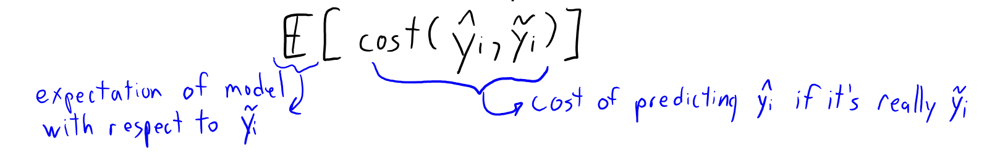
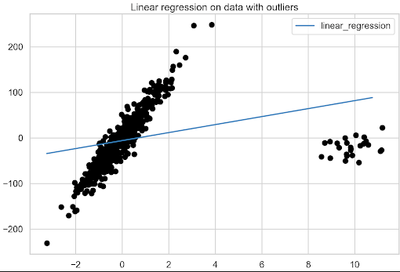
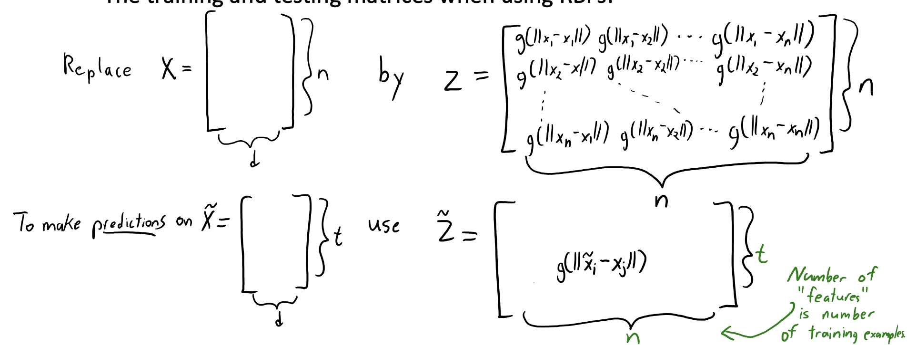
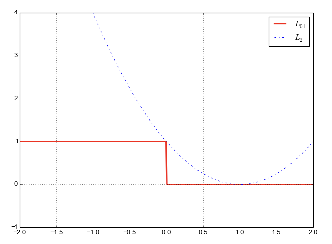
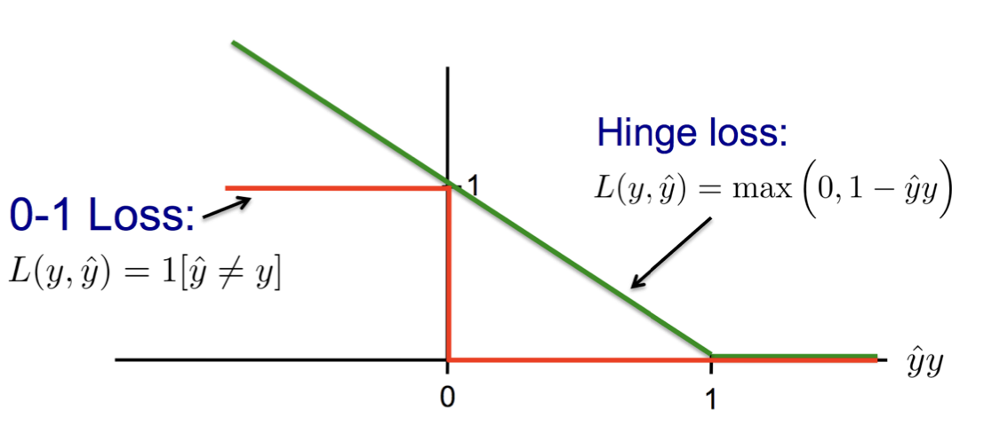
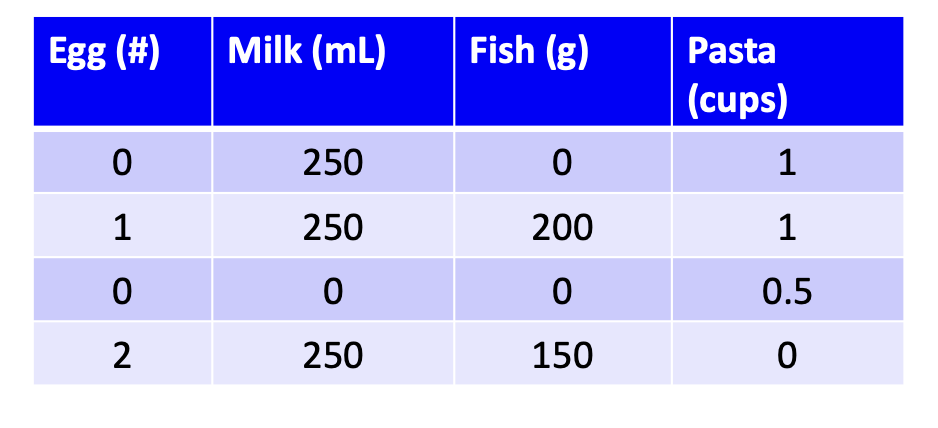
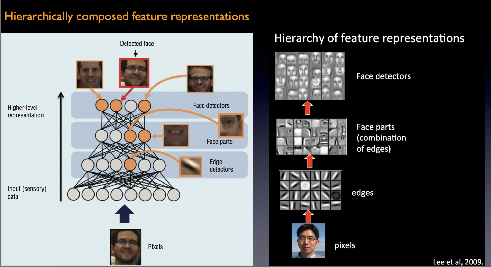
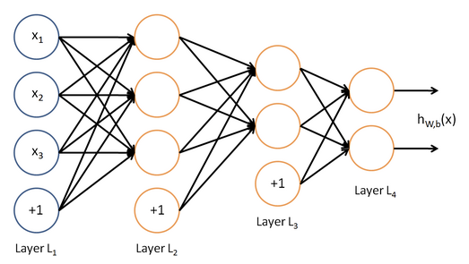
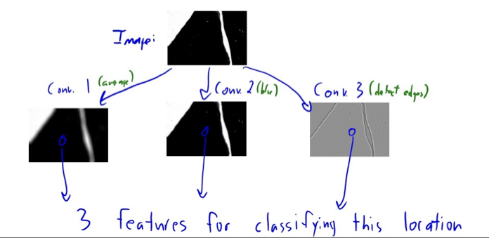

# Data Mining & Summary Statistics

- data: collection of examples and their features

  - an example = a row
  - each column is a feature

- types of data: categorical (unordered set), numerical (ordered sets - there's ordering/magnitude)

  - use OHE converting categorical into numerical features (don't assign random numbers because they can have scales)

    	

- ==coupon collecting problem==

  - if there are $n$ different categories within a feature - you'd need to approximately $O(n \log n)$ samples to catch them all (grows a lot with the number of larger $n$)

- feature aggregation: combine features to create new features 

  - you get less categories in general and lose some granularity - but also possibly more True examples of each

- discretization (binning): turn numerical to categorical features (ex. for age)

- categorical summary statistics:

  - frequencies of different classes
  - mode: category that occurs the most often

  - quantiles: categories that occur more than $t$ time 

- continuous summary statistics

  - measure of location
    - mean: average value
    - median: value such that half points are larger/smaller
    - quantiles: value such that $k$ fraction of points are largers
  - measure of spread
    - range: min and max value
    - variance: how far values are from mean
    - interquartile ranges

- entropy: measure of randomness in a set of variable

  - for a categorical variable taht can take $k$ values, we say
    $$
    \text{entropy} = - \sum^k_{c=1}p_c \log p_c ~~~~~~ \text{ where $p_c$ is the proportion of times you get the value $c$}
    $$

  - low entropy = very predictable 

  

# ML Fundamentals

- notation:

  - data is $X$
    - $x_{ij}$ is cell at row $i$, column $j$

    - $x_i$ is the list of all features for example $i$ (the entire row)

  - label is $y$

  - $d$ is the dimension (number of features)

  - $n$ is the number of examples

- typical <u>supervised ML</u> phases:

  - training phase: use X and y to find a model
  - prediction phase: given and example $x_i$, use model to predict a label $\hat y_i$ (note the hat - because it's prediction)
  - training error: fraction of times our prediction $\hat y_i \neq y_i$

- testing data is the data we want to label

  - denoted with a tilde (ex. $\tilde{X}$, $\tilde{y}$)

- bedrock principle/golden rule: ==TEST DATA CANNOT INFLUENCE TRAINING PHASE IN ANY WAY==

  - if you simply cherry pick a model based on its performance on the test data - that's still letting tests data influence your training 
    - (in sense, you're training the model to do well on that one particular test set, there maybe other test sets out there that your model won't do well on)

- IID assumption: we assume that 

  - all examples come from the same distribution (identically distributed)
  - examples are sampled independently (order doesn't matter)
  - note: usually not the case but as long as it's close to IID it's ok
  - result: <u>if testing/training examples are IID - then patterns in training examples are likely to be the same in test examples</u>

- types of error:

  - training error ($E_{\text{train}})$: how well your model did on the training set

  - test error ($E_{\text{test}}$): how well your model did on the test set 

    - note: ==training data generally tell us very little &rightarrow; care more about test error==

  - approximation error ($E_{\text{approx}}$): difference between training error and testing error 

     

  - simple models have low $E_{\text{approx}}$ (not very sensitive to training data) but $E_{\text{train}}$ might be high

  - complex models can have low $E_{\text{train}}$ but $E_{\text{approx}}$ might be high

- ==fundamental tradeoff==: generally, as $E_{\text{train}}$ increases, $E_\text{approx}$ decreases (and vice versa)

  - different models make different trade-offs

  - simple models (i.e. decision stumps)
    - training error is a good approximation of test error (not v sensitive to the training data)
    - but doesn't fit the training data very well

  - complex models (i.e. decision trees)
    - fit training data well
    - training error is a poor approximation of test error 

- ==validation error==: use part of training data to approximate test error (because we can't look at test data)

  - split training examples into training set and validation set (train on training set and test on validation set)

    

    - split should be random each time

  - we can say that validation error is an unbiased approximation of the test error (i.e. $\mathop{\mathbb{E}}(E_{\text{valid}}) = \mathop{\mathbb{E}}(E_{\text{test}})$)

- overfitting: if model is very complex, then it'll learn unreliable patterns to get every training example correct

  - increasing complexity of models = more chance of overfitting

  - bad because the model is now resistant to new data

  - sign: when training error is low but big gap between training error and validation error

- optimization bias:

  - if validation error is used once &rightarrow; it is an unbiased approximation of the test error

  - if you use it many times to pick the best model - you are overfitting on to the validation set

  - (cross-validation kinda solves this problem because in a sense it gives us many validation set that our model can average over?)

- cross-validation:

  - train on (say) 80% of the training data, validate on the other 20%

  - repeat this $k$ times with different splits, and average the score

    	

- ==no free lunch theorem==: there is no "best" model achieving the best generalization error for every problem

  - model A generalizes better to new data than model B on one dataset, there is another dataset where model B works better


# Supervised ML

- purpose: use data to find a model that outputs the right label based on the features
  - you have training labels to work with

## Decision Trees

- idea: is a simple programming consisting of `if/else` decisions (splitting rules) the returns a class label at the end of each sequence

   there are many possible trees and we want to look for the best ones	

### Decision Stump

- <u>decision stump</u>: simple tree with 1 splitting rule based on thresholding 1 feature

- to learn a stump we need:

  1. what feature should we use to split the data
  2. what value of the threshold should be used (only need to test values present in the data)
  3. what classes should we use at the leaves (when we have more than 2)

- psuedocode

  ```
  for each feature 'j': (column of X)
  	for each threshold 't': (values within that column)
  		set y_yes to most common label for examples that satisfy the rule (i.e x_ij > t)
  		set y_no to most common label of objects that does not satisfy rule
  		compute y_hat (our predictions for each object 'i' based on rule - y_hat)
  			(y_hat_i = y_yes if satisfy, y_hat_i = y_no otherwise)
  
  		compute error 'E' - the number of objects where y_hat != y
  		store the rule (j, t, y_yes, y_no) if it has the lowest error so far
  ```

- decision stump cost:
  - there are $n$ examples, $d$ features and $k$ thresholds (# of unique values in a column)
  - outer for loop is $O(d)$, inner for loop is $O(k)$, within the for loop to compute $\hat y$ takes $O(n)$ (need to scan through the rows)
  - ==time complexity: $O(ndk)$== &rightarrow; bad if $k$ is large

- resources:

  - runtime:
    - training: $O(ndk)$
    - predict: $O(1)$ because if/else statements is fast

  - space: 
    - $O(1)$ &rightarrow; just 1 rule


### Learning Decision Trees

- impossible to get the best possible trees - the combinations are simply too big

  - try and look for a local optimum as opposed to a global optimum 

- start with the stump - pick the best stump

  - split the data into two smaller datasets

  - repeat the process at every subsequent node as well recursively 

  - ex. depth-2 tree

    	

- score function for decision trees: we use ==information gain==
  $$
  \begin{align*}
  \text{information gain} &= \text{entropy}(y) - \left(\dfrac{n_\text{leaf 1}}{n} \cdot \text{entropy}(y_\text{leaf 1}) \right) - \left(\dfrac{n_\text{leaf 2}}{n} \cdot \text{entropy}(y_\text{leaf 2}) \right) \\ 
  \\
  \text{entropy}(y) &= \text{entropy of labels before split} \\
  n_\text{leaf i} &= \text{number of lables assigned to leaf }i \\
  \text{entropy}(y_\text{leaf 2}) &= \text{entropy of labels assigned to leaf } i
  \end{align*}
  $$

  - info gain is always positive - baseline is 0 (initial value is also 0)
  - we keep splitting to decrease entropy

- resources: 

  - note: this is for <u>fixed depth</u> decision trees
  - note: there are $n$ examples, $d$ features and $k$ thresholds (# of unique values in a column)
  - runtime
    - train: $O(\text{depth} \times ndk)$

- FAQ for decision trees

  - you can revisit a feature of a split
  - how to determine depth
    - some implementation stops at a max dpeth
    - some stop if too few examples in leaf
    - some stop if info gain is too small
    - "guess-and-check" with cross-validation

## Naive Bayes (Probabilistic Models)

- common example is spam filtering

  - text are encoded using BoW representation: features are words and each row is a sentence &rightarrow; $x_{ij} = 1$ if the word is present in the sentence

    	

- idea: classify it as spam if probability of spam is higher than probability of not spam
  $$
  \hat y_i = \begin{cases}
  \text{ spam } &\text{ if } p(y_i = \text{spam}\mid x_i) > p(y_i = \text{not spam} \mid x_i) \\
  \text{ not spam } &\text{ otherwise }
  \end{cases}
  $$

  - it's based on Bayes Law

    	

- breaking down the components: all the formulas below are MLE of the probabilities

  - $p(y_i = \text{``spam''})$: use the proportion in your data
    $$
    p(y_i = \text{spam}) = \dfrac{\text{\# of spam messages}}{\text{\# of total messages}}
    $$

  - $p(x_i)$ (the denominator): is actually super hard to approximate

    - but turns out <u>we can ignore</u>

  - $p(x_i \mid y_i = \text{ spam})$

    - hard to approximate still - but we can't ignore this one

    - ==Naive Bayes assumption==: we assume all features $x_i$ are conditionally independent given label $y_i$

      	

    - this assumption is not true at all but it's an assumption we make

    - ex. we want to look for $p(\text{vicodin} = 1 \mid \text{spam} = 1)$
      $$
      p(\text{vicodin} = 1 \mid \text{spam} = 1)  = \dfrac{\text{\# of spam messages w/ vicodin}}{\text{\# of spam messages}}
      $$

    - so finally we need the product of all the columns

    $$
    \begin{align*}
    p(x_i \mid y_i = \text{spam}) &= \prod^{d}_{j=1}p(x_{ij} = 1 \mid y_i=\text{spam}) \\
    &= \prod^{d}_{j=1} \dfrac{\text{\# of spam messages w/ word }j}{\text{\# of spam messages}}
    \end{align*}
    $$

- Naive Bayes formally
  $$
  \begin{align*}
  p(y_i \mid x_i) &= \dfrac{p(x_i \mid y_i)}{p(x_i)} \\
  &\propto p(x_i \mid y_i) p(y_i)\\
  &= \left[\prod^d_{j=1} p(x_{ij} \mid y_i) \right]p(y_i)
  \end{align*}
  $$

- Laplace smooth

  - naive Bayes kinda shits itself when calculating the marginal probability and a word doesn't occur (you get a 0)

    	
  
- resources:

  - runtime: 
    - training: $O(ndk)$ to compute the conditionals for each label
    - predicting: $O(k)$ I think

  - space: 


### Decision Theory

- TP/TN andFP/FN

  	

- the cost of prediction might not be the same

  - let a spam message through (false negative) is not a big deal

  - filtering a not spam (false positive) as spam is a bigger deal

  - we can assign costs to each scenario

    	

- now instead of predicting $\hat y_i$ to be the most probabilistic label, predict $\hat y_i$ to the label that minimizes the cost

  	

  - example

    	


## $k$-NN (Non-Parametric Models)

- idea/assumption: examples with similar features are likely to have similar labels

- to classify an example $\tilde x_i$

  1. find $k$ training examples $x_i$ that are nearest to $\tilde x_i$
  2. classify $\hat y_i$ using the most common labels among the nearest training examples

- most common distance function used is Euclidean distance
  $$
  \norm{x_i - \tilde x_i} = \sqrt{\sum^d_{j=1} (x_{ij} - \tilde x_{ij})^2}
  $$

  - this costs $O(d)$ to calculate for each pair of examples

- **model gets more complicated as $k$ decrease** ($k=1$ means the model is v. sensitive)

- there is no training phase (called lazy training)

  - you just store the data (which in itself is a bit of a pain)
  - cost $O(1)$ if you're using a pointer

- predictions are super expensive

  - $O(nd)$ to classify 1 test example (need to calc distance to every training point - calculation takes $O(d)$ each)
  - <u>prediction time grows with number of training examples</u>
  - storage is expensive: needs $O(nd)$ memory to store X and y
    - memory grows with number of training examples
    - ==since it depends on $n$ well call it non-parametric==

- parametric vs non-parametric

  - parametric: have fixed numbers of parameters: trained model size if $O(1)$
    - ex. naive bayes just store counts
    - ex. <u>fixed depth</u> decision trees just store the rules for that depth
  - non-parametric: number of parameters grows with $n$
    - model gets more complicated as you get more data
    - ex. KNN stores all training data, so size of model is $O(nd)$
    - ex. decision tree whose depth grows with the number of examples

- ==curse of dimensionality==: volume grows exponentially with dimensions

  - ==need at least $O(1/e^d)$ points to guarantee "close" points exist everywhere== - if not the algorithm won't work very well and is kinda useless
  - in worst case, "nearest" neighbour is really far and it doesn't mean anything

- KNN is problematic if features have very different scales

  - ex. measurements in grams vs kilograms (they are the same but g is 1000 times bigger)
  - you can try to normalize

## Defining Distance with Norms

- norms are a way to measure the “size” of a vector

  - most common is L2 norm (Euclidean distance)

- different kinds of norms

  

  - mathematically 
    $$
    \begin{align*}
    &L_2: \norm{r}_2 = \sqrt{\sum^d_{j=1} r_j^2} &L_1: \norm{r}_1 = \sum^d_{j=1} \abs{r_j} &&L_\infty: \norm{r_i}_{\infty} = \max_j\{\abs{r_j}\}
    \end{align*}
    $$

  - note: L2 norm is the most popular ones so most of the time the subscript is omitted

  - off-script - L0 norm: the L0 norm **counts the total number of nonzero elements of a vector**

- using the norms to measure distance

  	focus on the weights stuff

## Data Augmentation

- motivating example: want to classify hand writing into strings

  

- we may want our classifier to be invariant with certain transform (i.e scale, translation, rotation invariant)

  - hard/slow way: modify your distance function

    - find neighbours that require the “smallest” transformation of image

  - easy/fast way: data augmentation

    - just add transformed versions of your training examples to the training set

    - make translated/rotate/resized/warped versions of training images, and add them to train set

      	

    - pretty important for sound and stuff (adjust volume, add noise)

- augmentation help fill the space

## Ensemble Methods

- idea: use multiple classifier and aggregating their votes

  - wisdom of the crowds

- ensemble methods are classifiers that have classifiers as input

  - also called "meta-learning"

- often have higher accuracy than input classifiers by themselves

- voting vs stacking

  - voting: take the mode of the predictions across the classifiers

    	

  - stacking: fit another classifier that uses the prediction as features

    	

    - you can tune the second classifier too
    - the second classifier can in a sense assign weights to the different predictions and determine which predictions from which models are the most trustworthy

- why can voting work

  - if models are overfitting in different ways, it should still work fine
  - but if they are overfitting in the same way, voting does nothing
  - point is that we want models to have individual weaknesses that are different &rightarrow; hence we need to randomize

- types of ensemble methods and the fundamental tradeoffs

  - averaging: improves approximation error of classifiers with high $E_\text{approx}$ (because we're voting)
  - boosting: improves training error of classifiers with high $E_\text{train}$ (covered later)

### Random Forest

- tend to be one of the best "out of the box" classifiers

  - predictions are very fast

- how to make them different trees

  - bootstrapping: a way to generate different “versions” of your dataset (random sampling without replacement)
  - random trees: a way to grow decision trees incorporating randomness (have random depth for each one, split each slightly differently)

- note: ==adding more trees doesn't overfit for random forest== (because you're averaging)

- idea:

  - ensemble method based on deep decesision trees, incorporating two forms of randomness.
  - each tree is trained on a boostrap sample of the data ($n$ examples sampled with replacement)
  - we use random trees (covered today) to further encourage errors to be independent

- random forest ingredient 1: bootstrapping/bagging

  - bootstrap sample of a list of `n` training examples	

    - gives new dataset of n examples, with some duplicated and some missing	

  - bagging: ensemble where you apply same classifier to different bootstraps

    - generate several bootsrap samples of the dataset
    - fit classifier to each bootstrap sample
    - note: RF is a kinda of bagging where each classifier is a decision tree

- random forest ingredient 2: random trees

  - we want to inject randomness in the trees itself
  - for each tree
    - randomly sample a small number of features (typicall $\sqrt d$)
    - only let each split consider this sample of features

  - so splits will use different features between trees

- summary:

  - training:

    	

  - testing:

    	

- notes:

  - RF implementation usually have very deep trees (go until leafs have only 1 label)
    - individual trees tend to overfit

  - bootstrapping and random trees make it so that the trees make error independently of each other
    - so the vote itself tends to have a much lower test error than individual trees


# Unsupervised Learning

- in unsupervised learning: we only have $x_i$ values, but no explicit target values
  - and we want to do "something" with $X$

## $k$-Means Clustering

- clustering: we want to assign examples to groups

  - general goal: examples in same group should be similar, examples in different groups should be different

- "best" clustering is hard to define (because we do not have test error)

- $k$-means: a popular clustering methods

  - input:
    - number of clusters $k$ (hyper-parameter)
    - initial guess of the center (the "mean") of each clusters
  - algorithm
    - assign each $x_i$ to its closest mean
    - update the mean of the clusters now
    - repeat until convergence (==guaranteed when using Euclidean distance==)

- prediction: given a new test example, look at the cluster means, assign it to the label of the closest mean

- issues:

  - assumes you know the number of $k$ (you do not)
    - do hyper-parameter tuning (see below)
  - sensitive to initialization
    - you can do random restarts - randomly re-initialize the labels a few times, run K-means for each initialization, and pick the clustering that has the lowest final total WSSD
  - each example is assigned to one and only one cluster 
    - can't overlap clusters and ==can't leave something unclassified==
  - may converge to sub-optimal solution
  
- interpretation: at each step, $k$-means can be seen as minimizing an objective function - the squared distance from each example $x_i$ to its centre $w_{\hat y_i}$
  $$
  \text{objective} = f(w_1, w_2, \ldots, w_k, \hat y_1, \hat y_2, \ldots, \hat y_n) = \sum^n_{i=1} \norm{w_{\hat y _i} - x_i}^2
  $$

  - ==note==: $\hat y_i$ here is the cluster assigned to example $i$, $w_{\hat y_i}$ here means the mean of that cluster

- walkthrough

  	

- cost of k-means

  - bottleneck: calculating distance for each $x_i$ to each $w_c$ (cluster means) &rightarrow; cost $O(d)$ (number of features)
  - there are $k$ cluster means and $n$ total examples
    - so total cost of assigning examples to clusters is $O(ndk)$
  - updating means is $O(nd)$
  - we do this for many iterations until we hit convergence
  - total cost: $O(ndk \times I)$ where $I$ is the number of iterations (unknown)

- the clusters in $k$ means leads to partitions of the space

  		

  - note: clusters are always convex regions

  - leads to problem when the clusters in the data are not convex

     

- random fact: ensemble $k$-means usually suck

  - it's because the label itself are arbitrary (i.e 2 model might get the same cluster but they call them 0 vs 1s)

- hyper-parameter tuning: elbow method

  - for every run, you compute the "score" of the function - which is the euclidean distance of every point to its cluster mean - the score is sometimes called inertia

    - ex. if we had $k =3$, then
      $$
      \begin{align*}
      \text{inertia} = \sum_{P_i \in C_1}  distance(P_i, C_1)^2 + \sum_{P_i \in C_2}  distance(P_i, C_2)^2 + \sum_{P_i \in C_3} distance(P_i, C_3)^2
      \end{align*}
      $$

    - <u>**lower is better**</u> 

  - we can plot it and pick the $k$ with big improvement from $k − 1$ but not so much improvement in going to $k + 1$

    	here we would pick $k = 3$
  
  - k-means vs KNN
  
    

## Density-Based Clustering

- Density-Based clustering:

  - clusters are defined by "dense" region

    - examples in non-dense region are not classified (not trying to partition the space)
    - clusters can be non-convex
  - ==it is a <u>**non-parametric**</u> clustering method== (no fixed number of clusters $k$)
    - clusters can become more complicated with more data

- DBSCAN has 2 hyper-parameters

  - `epsilon` ($\varepsilon$): distance we use to decide if another point is a neighbour

    	

  - `min_neighbours`: number of neighbours needed to say that a region is "dense"

    	

    - if you have at least `min_neighbours` “neighbours”, you are called a “core” point

- main-idea: merge all neighbouring core points to form clusters

- pseudocode: intuitively, DBSCAN implements a "chain reaction" of sorts throughout the dense area

   ```
   for each example x_i:
   	if x_i already assigned to a cluster:
   		do nothing
     else:
     	check if x_i is a "core" point (>= min neighbours within epsilon)
     	if core_point:
     		make a new cluster and call the "expand cluster" function 
     		(spreads the reaction to a nearby point)
       else:
       	do nothing (could be an outlier)
   ```

  - `expand_cluster` function

    ```
    assign to this cluster all x_j within distance epsilon of core point x_i to this cluster
    for each new "core" point found, call "expand cluster" (recursively)
    ```

- walkthrough

  	

- depending on implementations: some points may not be assigned to a cluster 

  - good or bad, depending on application
  - ambiguity of "non-core" boundary point (can be kinda random bc it's dependant on which cluster the boundary point gets assigned to first )

- issues 

  - sensitive to the choice of `epsilon` and `min_neighbours`
    - not sensitive to initialization (except for boundary points)
  - if you get a new example, finding cluster is expensive 
  - again, curse of dimensionality (in high-dimensions, need a lot of points to ‘fill’ the space)

- resources:

  - time complexity: $O(n\log n)$
  - space complexity: $O(n)$

  

## Hierarchical Clustering

- can help build us a tree to see possible groupings

  - at any level, the groupings are a valid clustering of that data

- agglomerative (bottom up) clustering: most common

  	

  - what the fuck does this tree do for us


## Outlier Detection

- find observations that are “unusually different” from the others

  - aka anomaly detection

  - may want to remove outliers, or be interested in the outliers themselves (security)

    	

- note: it's always good to do some EDA and use your eyes and look at the data first

- global vs local outliers

  - global outliers: not within normal range of data

    	

  - local outliers: within normal data range, but far from other points

    	

  - thus it’s hard to precisely define “outliers"

### Model Based

- fit a probabilistic model &rightarrow; outliers are examples with low density

  > Example: 
  >
  > - assume data follows a Normal Distribution
  >
  > - we can compute the $z$ score as follows
  >   $$
  >   \begin{align*}
  >   &z_i = \dfrac{X_i- \mu}{\sigma} &\mu = \dfrac 1 n \sum^n_{i=1}x_i~\text{ (the mean)} &&\sigma = \sqrt{\dfrac 1 n \sum^n_{i=1}(x_i - \mu)^2}~\text{ (standard deviation)}
  >   \end{align*}
  >   $$
  >
  > - we say a point $z_i$ is an outlier if $|z_i| > 4$ or some other threshold (threshold determination is a bit arbitrary)

- problem with $z$ scores
  - mean and variance themselves are sensitive to outliers
  - it also assumes that the model is uni-modal

### Graphical Based

- steps:
  1. look at a plot of the data
  2. human decides if data is an outlier
- examples
  - box plot: 
    - visualization of quantiles/outliers
    - but only 1 variable at a time
  - scatterplot: 
    - can detect complex patterns
    - gives an idea of “how different” outliers are
    - but only 2 variables at a time
  - scatterplot array
    - look at all combinations of variables
    - laborious in high-dimensions
    - still only 2 variables at a time

### Cluster Based

- steps:
  1. cluster the data
  2. find points that do not belong to clusters (kind)

- $k$-means

  

  - find points that are far from any mean
  - find clusters with a small number of points

- DBSCAN

  	

  - outliers are any points not assigned to a clusters

### Distance Based

- idea: skip the model/plot/clustering and just measure distances

- KNN outlier detection

  - for each point, compute the average distance to its KNN

  - choose points with biggest values (or values above a threshold) as outliers

  - “outliers” are points that are far from their KNNs

    	

  - good for finding global outliers

- local distance-based outlier detection

  - find "outlier-ness" ratio of example $i$
    $$
    \text{outlierness} = \dfrac{\text{average distance of $i$ to its KNNs}}{\text{average distance of neighbours of $i$ to their KNNs}}
    $$

  - if $\text{outlierness} > 1$ then $x_i$ is further away from neighbours than expected &rightarrow; can label as outliers

  - good for ... local outlier detection

### Supervised ML Based

- use supervised learning
  - $y_i = 1$ if $x_i$ is an outlier
  - $y_i = 0$ if $x_i$ is a regular point
- we can use our methods for supervised learning
  - we can find very complicated outlier patterns
  - ex. classic credit card fraud detection methods used decision trees
- problem:
  - need to know what outliers look like
  - may not detect new “types” of outliers


# Regression

## Linear Regression

- <u>**it is supervised learning**</u>
  - does not give causality 
  - ex. good: higher index is correlated with lower grad %
  - ex. bad: higher index leads to lower grad %
- $y_i$ is numerical as opposed to categorical 
- most popular: linear regression based on least squares
  - interpretable and the building block for more-complex methods

### Linear Regression in 1D

- in 1D, we only have 1 feature ($d=1$)

  - ex. $x_i$ is number of cigarettes and $y_i$ is number of lung cancer deaths

- linear regression makes prediction $\hat y$ using a linear function of $x_i$
  $$
  \hat y_i = w x_i
  $$

  - $w$ is the weight/coefficient of $x_i$
  - interpretation: positive $w$ means as $x_i$ increase, $\hat y_i$ increases

- challenge: we want to find $w$

- residuals: difference between our predicted value and real value
  $$
  r_i = \hat y _i - y_i
  $$

  - typically want to look for $w$ that makes residual close to 0 (prediction line is good)

- many models minimize the <u>**sum of the squared residuals**</u>
  $$
  \begin{align*}
  SS_\text{residual} &= \sum_i r_i^2 \\
  &= (\hat y_1 - y_1)^2 + (\hat y_2 + y_2)^2 + \ldots + (\hat y_n - y_n)^2 \\
  &=(wx_1-y_1)^2 + (wx_2 - y_2)^2 + \ldots + (wx_n -y_n)^2 \\
  \end{align*}
  $$

- linear least squares look for $w$ that minimizes the sum of squared residuals
  $$
  \begin{align*}
  f(w)&= \dfrac 1 2 \sum^n_{i=1}(wx_i - y_i)^2 \\
  
  f'(w)&= w \sum^n_{i=1}x_i^2 + w \sum^n_{i=1} x_i y_i = 0 \\
  \therefore w&= \dfrac{\sum^n_{i=1} x_i y_i }{\sum^n_{i=1}x_i^2}
  \end{align*}
  $$

  - $f(w)$ here is the objective function
    - we added the constant 1/2 to make the math nice &rightarrow; <u>but this function has the same set of minimizers as the original</u>
  - we're looking to minimize $f$ &rightarrow; we can use calculus to do this

### Least Squares in $d$-Dimensions

- there can be many features that has a combine effect on the outcome

  - ex. we want to model the combined effect of smoking and asbestos on chances of lung cancer 

- in dimensions higher than 1, we are fitting a hyper-plane (not a line)

- in $d$ dimensions, the linear model is 
  $$
  \begin{align*}
  \hat y_i &= w_1 x_{i1} + w_2 x_{i2} + w_3x_{i3} + \ldots + w_dx_{id} \\
  &= \sum^d_{j=1} w_j x_{ij}
  \end{align*}
  $$

  - basically prediction is a weighted sum of all those feautres
  - note: this is not matrix notation yet so everything is still just a number (i.e $x_{ij}$ means the value at $(i,j)$)

- out objective function is still the same
  $$
  \begin{align*}
  f(w_1, w_2, \ldots, w_d) &= \dfrac 1 2 \sum^n_{i=1}(\hat y_i - y_i)^2 \\
  &= \dfrac 1 2 \sum^n_{i=1} \left(\sum^d_{j=1} w_j x_{ij}- y_i \right)^2 \\
  \\
  \dfrac{\partial f}{\partial w_i} &= \dfrac 1 2 \sum^n_{i=1} \dfrac{\partial f}{\partial w_i} \left(\sum^d_{j=1} w_j x_{ij}- y_i \right)^2\\
  &= \dfrac 1 2 \sum^n_{i=1} 2 \left(\sum^d_{j=1} w_j x_{ij}- y_i \right) \cdot \dfrac{\partial f}{\partial w_i}\left( \sum^d_{j=1} w_j x_{ij}- y_i \right)\\
  &= \sum^n_{i=1} \left(\sum^d_{j=1} w_j x_{ij}- y_i \right) \cdot x_{ij} &\text{every other $w$ gets ignored}
  \\
  \\
  \therefore \nabla f &= \begin{bmatrix}
  \sum^n_{i=1} \left(\sum^d_{j=1} w_j x_{ij}- y_i \right)x_{i\textcolor{red}{1}}\\
  \sum^n_{i=1} \left(\sum^d_{j=1} w_j x_{ij}- y_i \right)x_{i\textcolor{red}{2}} \\
  \ldots \\
  \sum^n_{i=1} \left(\sum^d_{j=1} w_j x_{ij}- y_i \right)x_{i\textcolor{red}{d}}
  \end{bmatrix}
  \end{align*}
  $$

  - set to 0 and we solve

### ==Matrix Notation==

- sometimes we express sums as matrix notation
  $$
  \begin{align*}
  f(w_1, w_2, \ldots w_d) &= \sum^n_{i=1} \left(\sum^d_{j=1} w_j x_{ij} - y_i \right)^2 \\
  f(\vec w)&= \norm{\mathbf{X}\vec w - \vec y}^2
  \end{align*}
  $$

  - matrix notation is often easier to code/write up (`numpy.linalg` is an amazing library)
  - note: I'll try my best to keep the notation consistent but sometimes vectors are written without the arrows - pay more attention to the subscripts

- in this course, we assume that vectors are column-vectors
  $$
  \begin{align*}
  \vec w = \begin{bmatrix}
  w_1 \\ w_2 \\ \ldots \\ w_d
  \end{bmatrix} ~~~~(\text{dim: } d \times 1) 
  
  &&\vec y = \begin{bmatrix}
  y_1 \\ y_2 \\ y_3 \\ \ldots \\ y_n
  \end{bmatrix} ~~~~(\text{dim: } n \times 1) 
  
  && \vec x_i = \begin{bmatrix}
  x_{i1} \\ x_{i2} \\ \ldots \\ x_{id} 
  \end{bmatrix} ~~~~(\text{dim: } d \times 1)
  \end{align*}
  $$

  $$
  \mathbf X = \begin{bmatrix}
  x_{11} &x_{12} &\dots &x_{1d} \\
  x_{21} &x_{22} &\dots &x_{2d} \\
  \vdots &\ddots \\
  \vdots & &\ddots \\
  x_{n1} &x_{n2} &\dots & x_{nd}
  \end{bmatrix}
  = \begin{bmatrix}
   (\vec x_1)^T  \\(\vec x_2)^T \\ \vdots  \\ \vdots \\ (\vec x_n)^T
  \end{bmatrix}
  $$

- sums and certain quantities can be expressed compactly in matrix notation

  - linear regression prediction for 1 example
    $$
    \hat y_i = \sum^d_{j=1} w_jx_{ij} = \vec {w}^T ~ \vec x_i
    $$
    
  - linear regression prediction for $n$ examples
    $$
    \hat y = \begin{bmatrix} 
    \vec {x}_1^{~~T}~ \vec w\\
    \vec {x}_2^{~~T}~ \vec w\\
    \ldots\\
    \vec {x}_n^{~~T}~ \vec w
    \end{bmatrix} = \mathbf X \vec w
    $$
  
  - the residual vector
    $$
    \vec r = \hat y - \vec y = \mathbf X \vec w - \vec y
    $$
  
    - ($\vec r$ is a $n\times 1$ vector of the residuals for each example)
  
  - sum of the residuals squared
    $$
    \begin{align*}
    f(w) &= \sum^n_{i=1} \left(\sum^d_{j=1} w_j x_{ij} - y_i \right)^2 \\
    &= \sum^n_{i=1} (\vec{w}^{~T} x_i - y_i) ^2 \\
    &= \sum^n_{i=1} (\hat y _i - y_i)^2 \\
    &= \sum^{n}_{i=1} r_i^2 \\
    &= \norm{r}^2 \\
    &= \norm{\mathbf X \vec w - \vec y}^2
    \end{align*}
    $$
  
- quick linear algebra review: let $a, b$ be vectors and $\mathbf A, \mathbf B$ be matrices
  $$
  \begin{align*}
  a^Tb &= b^Ta\\ 
  \norm{a}^2 &= a^T a \\
  (A+B)^T &= A^T + B^T \\
  (AB)^T &= B^TA^T \\
  (A+B)C &= AC + BC \\
  (A+B)(A+B) &= AA + BA + AB + BB \\
  (a +b)^T C &= a^TC + b^TC\\
  a^TAb &= b^TA^Ta
  \end{align*}
  $$

  - quick sanity check: check that the dimensions match
  
- ==objective function as a matrix==
  $$
  \begin{align*}
  f(w) &= \dfrac 1 2 \norm{Xw - y}^2 \\
  &= \dfrac 1 2 (Xw-y)^T(Xw-y) &&\text{see rule above} \\
  &= \dfrac 1 2 (w^TX^T - y^T) (Xw - y) &&\text{``disitrubted T" inisde first term} \\
  &= \dfrac 12 \left[w^T X^T(Xw -y) - y^T(Xw - y) \right] &&\text{multiplied out the terms} \\
  &= \dfrac 12 (w^T X^TXw - w^TX^Ty - y^TXw + y^T y) \\
  &= \dfrac 12 (w^TX^TXw -2w^TX^Ty + y^Ty) &&\text{because } a^TAb = b^TA^Ta \\
  &= \textcolor{violet}{\dfrac 1 2 w^TX^TXw - w^TX^Ty + \dfrac 1 2 y^T y}
  \end{align*}
  $$

  - solving the objective
    $$
    \begin{align*}
    f'(w) &= \dfrac 1 2 (2 \cdot X^TXw) - X^Ty + 0 = 0 \\
    X^TXw &= X^T y \\
    w &= (X^T X)^{-1}X^Ty
    \end{align*}
    $$
  
- aside: ==derivative of vector== ($\vec x$ is the variable vector, $\mathbf B$ is a constant matrix, $\mathbf b$ is a constant vector)
  $$
  \begin{align*}
  &f(\vec x) &&\rightarrow &&\dfrac{df}{d\vec x} \\ 
  \hline
  &\vec{x}^{~T} \mathbf B &&\rightarrow &&\mathbf B \\
  &\vec{x}^{~T} \mathbf b &&\rightarrow && \mathbf b\\
  &\vec x^{~T}\vec x &&\rightarrow &&2 \vec x \\
  &\vec{x}^{~T} \mathbf B \vec{x} &&\rightarrow &&2\mathbf B \vec x
  \end{align*}
  $$

  - trick: turn all the stuff that's not related to $w$ (i.e. $X^TX$) into a matrix variable like $\mathbf B$ and you can use the rules above

- ==sum/matrix conversion + norms as matrices==: 
  $$
  \begin{align*}
  \sum_{i}^n | r_i| &= \norm{\vec r} _{1} \\
  \sum_{i}^n |\lambda_i r_i| &= \norm{\mathbf \Lambda \vec r}_1 &\text{ where $\mathbf \Lambda$ is a diag. of $\vec \lambda$}\\
  \\
  \sum_i^n r_i^2 &= (\norm{\vec r}_2)^2 \\
  \sum^n_{i=1} v_i r_i^2 &= \norm{\sqrt{\mathbf V}~ \vec r}_2^2 = \vec r^{~T} \mathbf V \vec{r} &\text{ where $\mathbf V$ is a diag. of $\vec v$} \\
  \\
  \max_i\abs{r_i} &= \norm{\vec r}_\infty \\
  \\
  \sum^d_{i} v_i w_i &= \vec w^{T} \vec v
  \end{align*}
  $$

  - note: for the L2 norm - it only works if you square it, can't say anything about $\norm{\vec r}_2$ itself

- resources:

  - solving $d\times d$ system of equation costs $O(d^3)$
  - overall cost: $O(nd^2 + d^3)$

### Adding Bias ($y$-intercept)

- in least-squares above we didn't have a y-intercept $w_0$

  - without an intercept, if $x_i = 0$ then we must predict $\hat y_i = 0$

- adding a bias variable ($y$ intercept)

  - trick: make a new matrix $Z$ with an extra feature that's always 1

  $$
  \begin{align*}
  &X = \begin{bmatrix}
  -0.1 \\ 0.3 \\ 0.2
  \end{bmatrix}
  &Z= \begin{bmatrix}
  1 & -0.1 \\
  1 & 0.3 \\
  1 &0.2
  \end{bmatrix}
  \end{align*}
  $$


### Least Squares Issues

- solution might not be unique

  - since it's not unique, if you have two features that are the same (i.e they're both 1s) then you can decrease the weight on the first one and make up for it by increasing the weight for the second one
    $$
    \hat y_i = w_1x_{i1} + w_2\underbrace{x_{i1}}_{\text{copy}} = (w_1 + w_2)x_{i1} + 0x_{i1}
    $$
    so solution can either be $(w_1, w_2)$ or $(w_1 + w_2, 0)$ - they both minimizes least squares

  - this is a special case of features being <u>**colinear**</u> (one feature is a linear function of another)

- it's sensitive to outliers

- it always uses all features

- might predict outside range of $y_i$ values 

  - ex. some applications only positive $y_i$ are accepted (makes invalid prediction)

- it assumes a linear relationship between $x_i$ and $y_i$

- <u>no solution if $X^TX$ is not invertible &rightarrow; is the case when $n < d$</u>

- cost: insanely expensive sometimes

  - runtime: finding $w$ for least squares is very slow if $d$ is large
    $$
    \underbrace{(X^TX)}_{O(nd^2)}w = \underbrace{X^Ty}_{O(nd)}
    $$

    - cost above are because they are matrix multiplication
    - total cost of solving a $d \times d$ system is $O(d^3)$

  - space: data might be so big we cannot store $X^TX$


## Non-Linear Regression

- many relationships are better modelled by non-linear models

  	

- we can use linear least square to fit a quadratic model 

  - use the same change of basis approach as above
    $$
    \begin{align*}
    &X = \begin{bmatrix}
    0.2 \\ -0.5 \\ 1 \\ 4
    \end{bmatrix}
    &Z= \begin{bmatrix}
    1 & 0.2 &(0.2)^2 \\
    1 & -0.5 &(-0.5)^2\\
    1 &1 &(1)^2\\
    1 & 4 &(4)^2
    \end{bmatrix}
    \end{align*}
    $$

  - we now fit new parameters $v$ under "change of basis"
    $$
    \text{solve } Z^TZv = Z^t y
    $$

  - the result is a linear function of $w$ (technically $v$ now) but a quadratic function of $x_i$
    $$
    \hat y_i = v^Tz_i = \underbrace{v_1}_{w_0} \underbrace{z_{i1}}_{1} +\underbrace{v_2}_{w_1}\underbrace{z_{i2}}_{x_i} + \underbrace{v_3}_{w_2}\underbrace{z_{i3}}_{x_i^2}
    $$

- this could be expanded to any polynomial degree

  	

  - ==$p$ is now a hyper-parameter==
  - if you have multiple features, you have to do $d \times p$  features
    - let $k = d \times p$
    - $Z$ would be $n \times k$ so $v$ would be $k$ 
  - you could make a new column too that is interactions between 2 features ($x_1 \times x_2$) - everything is fair game

- degree of polynomial & fundamental trade off

  - as polynomial degree increases, the training error goes down

    	

  - approximation error goes up &rightarrow; we start overfitting with large $p$

  - use cross validation to find best $p$


## Gradient Descent

- notation:

  - function being optimized is called the <u>objective</u> (also sometimes called "loss" or "cost")

  - set we are searching over for an optimum is called the <u>domain</u>

  - a set of parameters $w$ that achieve the min-value is called the <u>minimizer</u>

  - stationary point: point $w$ where $\nabla f(w) = 0$ (also called critical points - green arrow below)

    	

    - if we're minimizing, we'd like to find the global maximum, but not always possible

- <u>**we use gradient descent because sometimes solving least squares is too expensive**</u>

- ==important calculus==: **the gradient $\nabla f(x)$ points in the direction of the greatest increase of the function**

  - so by plugging in point $x_0$, you're finding the direction the has the steepest increase
  - so in gradient descent, <u>you want to do steepest decrease, intuitively you walk directly opposite from this direction</u> (hence the minus sign)

- intuitive explanation: 

  - it's like you're going down the hill, you'd like to take incrementally small steps in the direction that you feel is the most "down"
    - the hill here is the objective function
  - so you look around for what feels the most downhill, you step in that direction
  - once you're at your new spot, you again look for the next spot that feels the most down hill
  - you go until you get to a spot where every step you can possibly take is uphill 

- gradient descent is an iterative optimization algorithms (note: superscripts here are iteration numbers)

  1. start with a "guess" $w^0$

  2. generate new guess by moving in the negative gradient diresction

     - ex. uses the gradient $\nabla f(w^0)$ to generate a better guess $w^1$
     - ex. use the gradient $\nabla f(w^1)$ to generate a better guess $w^2$

  3. rinse and repeat to refine the guess

     - mathematically:
       $$
       w^{t + 1} = w^t - \alpha^t \nabla f (w^t) ~~~ ~~~~t = 1, 2, 3, \ldots
       $$

     - <u>$\alpha$ is the step size or the learning rate (hyper-parameter)</u>

  4. stop if not making progress or $\norm{\nabla f(w^t)} < \varepsilon $ (some small scalar)

     - the limit of $w^t$ as $t$ goes to $\infty$ has $\nabla f(w^t) = 0$

- ==gradient descent converges to a global optimum if $f$ is convex==

- gradient descent in least squares setting

  - recall
    $$
    \begin{align*}
    &f(w) = \dfrac 1 2 \norm{Xw - y}^2 &&\nabla f(w) =X^T(Xw - y)
    \end{align*}
    $$

  $$
  \therefore w^{t+1} = w^t - a^tX^T(Xw^t -y)
  $$

  - note: $w^t$ is not power or transpose - it's the iteration

- resources: gradient descent is faster when $d$ is very large

  - runtime: $O(ndt)$ for $t$ iterations (each iteration takes $O(nd)$)

- step size (learning rate) considerations:

  - $\alpha^t$ must be considered carefully for gradient descent to work
  - if $a^t$ too large gradient descent may not converge
  - if $a^t$ is too small gradient descent may be too slow

### Convex Functions

- definition: a convex function is a function where if you place 2 point on the function and raw a line between them, it will never go underneath the function line

  	

- we are guaranteed to find a min at $\nabla f(w) = 0$ for convex functions

- convex functions hack

  - linear functions are convex (i.e $f(x) = x$)
  - a convex function multipled by a non-negative constant is convex
  - nroms and squared norms are convex
  - the sum of convex functions is a convex function
  - the max of convex functions is a convex function
  - composition of a convex function and a linear function is convex

- another way to determine convexity

  - ex. consider
    $$
    f(w) = \norm{Xw - y}^2 
    $$
    we can use the fact that this is a convex function composed with linear
    $$
    \begin{align*}
    \text{let } h(w) &= Xw - y &&\text{which is a linear function}\\
    \text{let } g(r) &= \norm{r}^2 &&\text{which is convex because it's a squared norm} \\
    \text{then } f(w) &=g(h(w)) &&\text{which is convex b/c it's a convex function composed with linear function}
    \end{align*}
    $$

    

## Robust Regression

- regular least squares is very sensitive to outliers

   

- problem stems from the fact that you're squaring the errors

  - magnifies the large errors (which in turn the line tries to minimize so it skews it)
  - so outlier influence the line much more than the other points

- <u>**robust regression objective is to focus less on large errors (outliers)**</u>

  - in our case we use absolute error instead of squared error

    $$
    \begin{align*}
    f(w) &= \sum^n_{i=1} \abs{w^T x_i - y_i} \\
    &= \norm{X_w - y}_1
    \end{align*}
    $$

    - decreasing ‘small’ and ‘large’ errors is equally important.
    - instead of minimizing L2-norm, minimizes L1-norm of residuals

- <u>minimizing the asbolute error is hard</u>

  - don't have normal equations for minimzing the L1 norm

  - also not differentiable at 0 (so gradient descent won't work)

    	

  - it's usually harder to minimize non-smooth than smooth functions

  - <u>to apply gradient descent, we will use a **smooth approximation**</u> (differential approximate to the original non-smooth function)

- popular method and the one we'll use is <u>**Huber Loss smooth approximation**</u>
  $$
  \begin{align*}
  f(w) &= \sum^n_{i=1} h(w^T x_i - y_i)\\
  h(r_i)&= \begin{cases}
  \dfrac 1 2 r_i^2 &\text{ for} \abs{r_i} \leq \varepsilon \\
  \varepsilon \left(\abs{r_i} - \dfrac 1 2 \varepsilon \right) &\text{ otherwise}
  \end{cases}
  \end{align*}
  $$

  - so <u>within the epsilon band, it behaves like a quadratic, everything outside of that band and it behaves like a absolute error</u>

    	

  -  note that $h$ is differentiable: $h'(\varepsilon) = \varepsilon $ and $h'(-\varepsilon) = -\varepsilon$

  - $f$ is convex but $\nabla f = 0$ <u>**does not give a linear system**</u> (can't solve unless use gradient descent)

- using non-convex error can be very robust

  	

  - not influenced by outlier groups	

  - but hard to solve - might be multiple local optima that's not a global optima

  - basically have no guarantees that we would have with convex functions


## Brittle Regression

- sometimes you really care about getting outliers right

  - you want to minimize the size of worst error across examples
  - ex. if in worst case is the plane can crash

- you could use something like the infinity norm

  	

- very very sensitive to outliers, but minimizes highest error

  - different than previous errors, which were all some sort of average

- L-$\infty$ is convex but non-smooth

  - can again use a smooth approximation and fit it with gradient descent

- smooth approximation to max function is **<u>log-sum-exp</u>** function
  $$
  \max_i \{z_i\} \approx \ln(\sum_i \exp(z_i))
  $$
  	

  - note: $\ln$ is sometimes replaced with $\log$ and $\exp(x) = e^{x}$
  - intuition: taking the log sum is about the same as taking the max because the max element is magnified exponentially
  - this is the basis of logistic regression

## Scoring Function 

- how to pick the best models

  - picking lowest training error &rightarrow; this will always pick large $p$ 
  - picking lowest validation error &rightarrow; will also tend to large $p$ due to optimization bias 

- we want simple models as opposed to complex models
  $$
  y_i = 2x_i^2 -5 ~~~~\text{ vs. }~~~~ y_1=0.00001x_i^3 + 2x_i^2 -5 
  $$

  - we would prefer the quadratic here

- complexity penalties

  - idea: put a penalty on the model complexity 

- scoring function
  $$
  \text{score}(p) = \dfrac{1}{2} \norm{Zv - y}^2 + \lambda k
  $$

  - $k$ is the number of estimated parameters (aka degree of freedoms)
    - for polynomial basis, we pick $k = p+1$ (number of columns after basis transform)
  - $\lambda$ controls how strong we penalize complexity
    - you need to decrease the training error by at least $\lambda$ to increase $k$ by 1 
  - note: this is a scoring function - used to evaluate a model &rightarrow; usually used for feature selection (L0 regularization)

  

# Feature Selection

- general problem: find the features (columns) of $X$ that are important for predict $y$
- ==note: model gets more complex as you add more features==

## Search and Score Method

1. define score function $f(S)$ that measures quality of a set of features $S$

2. search for the set $S$ that gives the best score

   > Example: X has 3 features
   >
   > - compute score for $S = \{1\}$
   > - compute score for $S = \{2\}$
   > - compute score for $S = \{3\}$
   > - compute score for $S = \{1,2\}$
   > - compute score for $S = \{1,3\}$
   > - compute score for $S = \{2,3\}$
   > - compute score for $S = \{1,2,3\}$
   > - compute score for $S = \{\}$
   >
   > return the set of features $S$ that gives the best score

- problem: super slow when there's large number of features

  - when we have $d$ features, there are $2^d$ sets of variables (combinations)
  - leads to optimization bias &rightarrow; ==prone to false positives, irrelevant variables will sometimes get better score by chance==

- to reduce false positives, we can use complexities penalties
  $$
  \text{score}(S) = \dfrac 1 2 \norm{Xw - y} + \lambda \norm{w}_0
  $$
  

  - we use the $L0$-norm ($L0$-norm is basically the number of non-zero values of the weight vector $w$)
  - because setting weight to 0 is basically the same as saying to discard that column

- effect of $\lambda$

  - it balances between training error and number of non-zero features
  - larger $\lambda$ puts more emphasis on having zeroes in $w$ (more features removed)

## Forward Selection 

- in search and score, it's hard to search for best $S$ - power set is too big
  - forward selection is a greedy approach to feature selection

1. Start with empty set of features, $S = \{\}$
2. For each possible feature $j$ 
   - Compute scores of features in $S$ combined with feature $j$
3. Find the $j$ that has the best score when added to $S$
4. Check if $\{S \cup j\}$ improves on the best score found so far
5. Add $j$ to $S$ and go back to step 2
   - a variation is to stop if no $j$ improves the score over just using $S$

> Example: 
>
> 1. Compute score if we use no features
> 2. Try adding "taco", "milk", "egg", and so on (<u>computing score on each</u>)
> 3. Add "milk" because it got the best score
> 4. Try {"milk", "taco"}, {"milk", "egg"} and so on (computing score of each variable <u>with milk</u>)
> 5. Add "egg" because it <u>got the best score combined with "milk"</u>
> 6. Try {"milk", "egg", "taco"}, {"milk", "egg", "pizza"} and so on ...
> 7. Rinse and repeat ...

- runtime of forward selection:

  - we fit $O(d^2)$ models - out of $2^d$ possible models
    - each steps requires fitting up to $d$ models, and there are up to $d$ steps
  - total cost will be $O(d^2) \times \text{ cost of fitting an individual model}$
    - ex. for least squares: it's $O(nd^2 + d^3)$ to fit model, so total runtime is $O(nd^4+d^5)$ 
- not guaranteed to find the best set - but is cheaper, overfits less and <u>has fewer false positives</u>

## Ensemble Feature Selection

- we can also use ensemble methods for feature selection

  - <u>usually designed to reduce false positives or reduce false negatives.</u>
    - in the case of L1-regularization, we want to reduce false positives.

- unlike L0-regularization, the non-zero $w_j$ are still “shrunk”.

  - “irrelevant” variables can be included before “relevant” $w_j$ reach best value.

- a bootstrap approach to reducing false positives:

  - apply the method to bootstrap samples of the training data
  - only take the features selected in all bootstrap samples.

- diagram

  	


# Regularization

- complex models tend to overfit &rightarrow; there are a couple of fixes
  - model averaging: average over multiple models to decrease variance
  - regularization: add a penalty on the complexity of the model

## L2-Regularziation

- standard approach: impose L2-regularization on objective functions
  $$
  f(w)= \dfrac{1}{2} \norm{Xw -y}^2+ \dfrac \lambda 2\norm {w}_2
  $$

  - idea: large slopes tend to lean to overfitting
  - objective: balances getting low error vs. having small slopes $w_j$
  - nearly always reduces overfitting
    - regularization increases training error
    - regularization decreases approximation error
  - $\lambda$ is a hyper-parameter and probably should be optimized
  - note: $\norm{Xw - y}$ increases with $\lambda$ while $\norm{w}$ decreases with $\lambda$
    - though individual $w_j$ can increase or decrease with lambda (the norm decreases)
    - because we use L2 norm - large one decrease the most

- solving L2 Regularization
  $$
  \begin{align*}
  f(w) &= \dfrac 1 2 \norm{Xw -y }^2 + \color{violet}{\dfrac \lambda 2 \norm{w}^2} \\
  &= \dfrac 1 2 (w^TX^TXw - 2w^TX^Ty + y^T y) +  \color{violet}{\dfrac{\lambda}{2} w^Tw} \\
  \nabla f(w) &= X^TXw- X^Ty+0 +\textcolor{violet}{\lambda w} = 0\\ 
  X^TXw + \textcolor{violet}{\lambda w} &= X^Ty  \\
  (X^TX + \textcolor{violet}{I\lambda})w &= X^Ty \\
  w &= (X^TX + \textcolor{violet}{I\lambda})^{-1}X^Ty
  \end{align*}
  $$

- gradient descent for L2 Regularizzation
  $$
  \begin{align*}
  f(w) &= \dfrac 1 2 \norm{Xw -y }^2 + \color{violet}{\dfrac \lambda 2 \norm{w}^2} \\
  \nabla f(w) &= X^T(Xw- y) +\textcolor{violet}{\lambda w}
  \\\\
  w^{t+1} &= w^t - a^t \left[X^T(Xw^t- y) +\textcolor{violet}{\lambda w^t} \right]
  \end{align*}
  $$

  - cost: still $O(nd)$
  - not obvious: ==can show number of iterations decrease as $\lambda$ increases==

## Standardizing

- consider continuous features with different scales

  	

  - doesn't matter for naive trees or Bayes
    - because it only look at 1 feature at a time
  - **<u>doesn't matter for least squares</u>**
    - $w_j \times 100\text{mL}$ gives the same model as $w_{j*} \times (0.1\text{L})$ where $w_{j*} = 1000 \times w_{j}$ (or something like that)

  - it matters for kNN
    - “distance” will be affected more by large features than small features
  - it <u>**matters for regularized least squares**</u>
    - penalizing $(w_j)^2$ means different things if features $j$ are on different scales

- common to standardize continuous features &rightarrow; for each features:

  1. compute mean and standard deviation (of the feature)
     $$
     \begin{align*}
     &\mu_j = \dfrac{1}{n} \sum^n_{i=1}x_{ij} &\sigma_j &=\sqrt{\dfrac{1}{n} \sum^n_{i=1} (x_{ij}-\mu_j)^2}
     \end{align*}
     $$

  2. subtract mean and divide by standard deviation ("z-score")
     $$
     \text{replace $x_{ij}$ with } \dfrac{x_{ij} -\mu_j}{\sigma_j} 
     $$

  - the cell now measures "standard deviations from mean" (changes in $w_j$ have similar effect for any feature $j$)

- standardizing test data: ==use mean and standard deviation of training data==

- if we're doing CV

  - compute $\mu_j$ and $\sigma_j$ based on the training folds (ex. average over 9/10s of data)
    - standardize the remaining ("validation") fold with this training $\mu_j$ and $\sigma_j$ 
  - re-standardize for each iteration/fold of CV (if not - violates bedrock principle)

- standardizing target: in regression, we sometimes standardize the target $y_i$
  $$
  \text{replace $y_i$ with } \dfrac{y_i -\mu_y}{\sigma_y}
  $$

  - puts targets on the same standard scale as standardized features

  - with standardized target, setting $w=0$ predicts average $y_i$

    - high regularization makes us predict closer to the average value
    
  - other common transformations of $y_i$ are log/exponent
    $$
    \text{ use } \log (y_i) \text{ or } \exp(... y_i)
    $$
  

## L1-Regularization

- we used L0 regularization for forward selection

  - if $d$ is large, forward selection is too slow
    - least squares: fit $O(d^2)$ models that cost $O(nd^2 + d^3)$ - total runtime is $O(nd^4 +d^5)$, even if you use tricks it's still $O(nd^2 + d^4)$
  - situation is worse if we're not doing basic least squares
    - robust regression: run gradient descent $O(d^2)$ times
    - with regularization: need to search for $\lambda$ $O(d^2)$ times

- instead of using L2 or L0 - consider regularize by the L1 norm
  $$
  f(w) = \dfrac{1}{2} \norm{Xw - y}^2 + \lambda \norm{w}_1
  $$

  - like L2, it’s convex and improves our test error.
  - like L0-norm, it encourages elements of $w$ to be exactly zero
  - <u>no closed form solution though - has to use gradient descent</u> (vanilla one won't work for this)

- L1 regularization simultaneously regularizes and selects features

  - very fast alternative to search and score
  - sometimes called “LASSO” regularization

- for any non-zero $w_j$

  - L0: constant penalty of $\lambda$ 
    - encourages you to set $w_j$ exactly to zero, but otherwise doesn't care if $w_j$ is small or not
  - L2: penalty gets smaller as you get closer to 0
    - penalty asymptotically vanities as $w_j$ approaches 0 (no incentive for exact 0)
  - L1: penalty is proportion how far away $w_j$ is from zero
    - there's still something to be gained from making a tiny value exactly equal to 0
  - point is: <u>L1-regularization gives sparsity (shrinks towards zero) but L2-regularization does not</u>

- L2 vs L1 regularization

  - both:
    - insentive to changes in data
    - decreases variance (lower test error)
  - difference:
    - L2 has closed form solution while L1 needs iterative solver
    - L2 solution is unique while L1 is not 
    - L2: all $w_j$ tend to be non-zero while for L1: many $w_j$ tend to be zero
    - L2 can only learn linear number of irrelevant features (ex. only $O(d)$ relevant features), L1 can learn exponential number of irrelevant features (ex. only $O(\log d)$ relevant features)
      - L1 can deal with more irrelevant features (if you have $d$ features but only $\log d$ relevant features - L1 can take care of it)

- $L^*$ regularization

  - L0-regularization (AIC, BIC, Mallow's CP, adjusted $R^2$)
    $$
    f(w) = \norm{Xw -y}^2 + \lambda \norm{w}_0
    $$

    - adds penalty on the number of non zeros to select features

  - L2-regularization
    $$
    f(w) = \norm{Xw -y}^2 + \dfrac{\lambda}{2} \norm{w}_2
    $$

    - adding penalty on the L2-norm of $w$ to decrease overfitting

  - L1-regularization
    $$
    f(w) = \norm{Xw -y}^2 + \lambda \norm{w}_1
    $$

    - adding penalty on the L1-norm decreases overfitting and selects features

- summary: 

  	

  - L1-Regularization isn't as sparse as L0-regularization
    - L1-regularization tends to give more false positives (select too many)
  - cost of L2-regularized least squares is $O(nd^2 + d^3)$
    - changes to $O(ndt)$ for $t$ iterations of gradient descent 
    - same cost for L1-regularized 
  - ==basically - certain regularizer is to prevent overfitting - but some (L0 and L1) also intrinsically does feature selection for you== 

  

## Loss vs Regularization 

- don't confuse the L1 loss with L1-regularization 

  - L1-loss is robust to outlier data pointers
    - you can use this instead of removing outliers
  - L1-regularization is robust to irrelevant features
    - you can use this instead of removing features (it will kinda do it for you by setting weights for those features to zero)

- note: you can be robust to outliers AND irrelevant features
  $$
  f(w) = \norm{Xw - y}_1 + \lambda \norm{w}_1
  $$

- additionally: can we use "Huber regularization" for smoothing the regularizer term

  - applying the Huber function the regularizer term would still be robust to irrelevant features 
  - but it's the non-smoothness that sets weights exactly to 0


# Non-Parametric Basis Transform (Gaussian RBFs)

- we've been using linear models with polynomial bases, but polynomials are not the only basis (ex/ exponentials, logarithms, trig functions)

  - using wrong basis limits our results despite number of data &rightarrow; but right basis may not be obvious

- non-parametric basis: size of basis (number of features) grows with $n$

  - model gets more complicated as you get more data
  - with enough data, you can model complicated functions where you don't know the right basis
  - classic example: ==Gaussian RBFs==

- Gaussian RBF

  	

  - they are universal approximators

    - enough bumps can approximate any continuous function to arbitrary precision
    - achieve optimal test error as $n$ goes to infinity 

  - example:

    	

  - note: 

    - for polynomial, extrapolating left or right you predict very large
    - for non-parametric - if you are in an area with no data, the prediction returns to 0

  - video:

    	

- some facts

  - we should use $n$ bumps
  - each bump is centered on one training example $x_i$
  - fitting regression weights $w$ gives us the heights of the bumps
  - $\sigma$ tells you how wide the bumps are (you need to pick this)

- hyperparameter: 

  - $\sigma$: control the width of the bumps
    - overfitting by setting $\sigma$ too low
  - $\lambda$: the regularization parameter
    - not really a hyper-parameter in the normal model - but will need to tune if you decide to regularize the objective 
    - increasing this will cause the the model to overfit less
    
  
- radial basis function (RBF)

  - set of non-parametric bases that depend on distances to training points
    $$
    \text{replace } x_i = (x_{i1}, x_{i2}, \ldots, x_{id}) \text{ with } z_i = \left( ~g({\norm{x_i - x_1}}), ~g(\norm{x_i - x_2}), ~\ldots, ~g(\norm{x_i - x_n}) \right)
    $$

    - $\norm{x_i - x_1}$ is distance of feature vector to example 1

  - have $n$ features, with feature $j$ depending on distance to example $i$

    - typically the feature will decrease as the distance increases

  - most common choice of $g$ is Gaussian RBF
    $$
    g(\varepsilon) = \exp \left(-\dfrac{\varepsilon^2}{2 \sigma^2} \right)
    $$

  - matrices view

    	

    - for $\tilde Z$, you use $x_j$ from the training data

  - pseudo-code (to build $Z$/$\tilde Z$)

    ```py
    Z = zeroes(n,n)
    for i1 in range(0, n):
      for i2 in range(0, n):
        Z[i1, i2] = exp(-norm(X[i1, :] - X[i2, :])^2 / (2 * sigma^2))
    ```

- fitting and predicting

  - solving for the weights $v$ (once you have $Z$)
    $$
    v = (Z^ZZ + \lambda I) ^{-1} Z^T y
    $$

  - predicting on $\tilde Z$
    $$
    \begin{align*}
    \hat y_i &= w_1 \exp\left(-\dfrac{\norm{x_i - x_1}^2}{2\sigma^2}\right) 
    + w_2 \exp\left(-\dfrac{\norm{x_i - x_2}^2}{2\sigma^2}\right) + \ldots 
    + w_n \exp\left(-\dfrac{\norm{x_i - x_n}^2}{2\sigma^2}\right) \\
    &= \sum^n_{j=1} w_j \exp\left(-\dfrac{\norm{x_i - x_j}^2}{2\sigma^2}\right) \\
    &= \tilde Z v
    \end{align*}
    $$

- if you want to model data that's away from the training data &rightarrow; you could add bias and linear basis

  	

  - away from the training data the gaussian will be 0, so you'll be basically doing regular linear regression

- hyperparameter tuning

  ```
  for every value of λ and σ:
  	- compute Z on training data (and σ)
  	- compute best v: v = (Z^T*Z + λI)^-1 Z^T * y
  	- compute Z_test on validation data (using training data distances)
    - make prediction: y_hat = Z_test * v
    - compute validation error: ||y_hat - y_test||^2
  ```

  - there are now 2 hyperparameters &rightarrow; harder to look for optimal combinations (2D space to search over)
  - makes searching all values expensive + increases over-fitting risk
  - simplest approaches
    - exhaustive search: within a grid of values for $\sigma$ and $\lambda$
    - random search: try random values within the grid

- combining everything: RBF basis w/ L2 regularization and cross validation (to choose $\lambda$ and $\sigma$) results in a model that's hard to beat

  - expensive at test time: need distance to all training example


# Linear Classifier

## Binary Linear Classifier

- idea is we want to use regression for binary classification (i.e flagging email as important or not important)

- set up

  - we set $y_i = +1$ for one class (i.e important) and $y_i = -1$ for the other (i.e not important)
  - the linear model would give us numbers like $0.9, -1.1$, etc and you predict based on if it's closer to 1 or -1
    - ex. $w^Tx_i = 0.9$, predict $\hat y_i = +1$
    - ex. if $w^Tx_i = -1.1$, predict $\hat y_i = -1$
    - we write this rounding operation as $\hat y_i = \text{sign}(w^Tx_i)$

- the decision boundary (is a linear line/plane)

  	

- ==why we can't use least squares for classification task==

  - reminder: $f(w) = \dfrac 1 2 \norm{Xw - y}^2$

  - least squares penalize our prediction for being "too right" (i.e $w^Tx_i = +100$ has the right sign, so the error should not be large)

  - examples: for 1 example
    - $w^Tx_i =0.9$ and $y_i = +1$ - error is $(0.9-1)^2 = 0.01$ (small)
    - $w^Tx_i = -0.8$ and $y_i = +1$ - error is $(-0.8-1)^2 = 3.24$  (bigger)
    - $w^Tx_i =100$ and $y_i = +1$ - error is $(100-1)^2 = 9801$  (crazy big even though prediction is correct)
    
  - thus, least squares can behave weirdly when applied to classification - in order to minimize its own squared error metric, it will make a really bad decision boundary

  - ==question: wouldn't this problem go away if we just make use the sign function - then $w^Tx_i$ can only ever be -1 or 1==

    - my guess: we basically do this - but the sign function is really fucking non-convex

       

    - if you look at this graph it looks like the 0-1 loss basically (just connected together)

- special case: "linearly separable" data

  - classes can be separated by a hyper-plane

  - so a perfect linear classifier exists

    	

    - **<u>left is linearly separable, right is not</u>**

  - in this special case, you can use the Perceptron Algorithm 

    - goal: searches for a $w$ such that $\text{sign}(w^Tx_i) = y_i$ for all $i$
    - if a perfect classifier exists, algorithm promises to find it in a finite number of steps

    ```
    - start with w^0 = 0
    - go through examples in any order until you make a mistake predicting y_i
    	- set w^(t+1) = w^t + (y_i * x_i)
    - keep going through examples until you make no errors on the training data
    ```

- note on Logistic Regression and SVM
  - used everywhere
  - fast training and testing
    - train using SGD
    - prediction is just computing $w^Tx_i$
  - weights $w_j$ are easy to understand
    - how much $w_j$ changes the prediction and in what direction

### 0-1 Loss Function

- we want to instead <u>minimize number of classification errors</u>

- you either get the classification wrong (add 1 to the loss) or right (add 0 to the loss)

- you can write this function with the L0 norm $\norm {\hat y - y}_0$ (number of non-zero element in the vector)

  - this works because in classification it's reasonable for $\hat y_i = y_i$ 
  
- geometry argument

  - let say in the current example, true label $y_i = 1$

  - we will be plotting <u>LOSS vs. Prediction</u> ($w^Tx_i)$ 

    	

  - here $L_2$ is the squared error loss and $L_{01}$ is the 0-1 Loss function

  - you can see that the $L_2$ line assigns huge loss to predictions that are either too right (too right of 1) or too wrong (too left of 1)

    - punishing for being too wrong isn't exactly a bad thing, but punishing for being too right makes no sense

  - now looking at $L_{01}$, you can see we assign a loss of 1 if the prediction is wrong, or 0 if the prediction is right 

    - ==TODID: again, is this assuming that our $\hat y_i = 1 \text{ or -1}$ only?== no, $w^Tx_i$ can be anything, it's the horizontal axis - though writing it as the 0-norm makes no sense, this would be some kind of if statements while watching for the sign - example

      ```python
      if (y_pred * y_true > 0):
        # they have the same sign - loss of 0
        return 0
      else:
        # they have different signs - assign loss of 1
        return 1
      ```
    
    - I believe you apply the $\text{sign}$ function to it so it can only be -1 and 1

- problem:

  - 0-1 loss is not convex in $w$
  - finding $w$ that minimizes 0-1 is also a hard problem
    - gradient is 0 everywhere, can't use gradient descent
  - solution: use convex approximations to 0-1 loss such as hinge and logistic loss

### Degenerative Convex Approximation to 0-1 Loss

- idea:

  - if $y_i = + 1$,  our prediction is correct if $w^Tx_i > 0$
  - if $y_i = -1$, our prediction is correct if $w^Tx_i < 0$
  - basically, we want to check if the signs of our prediction and true label match
  - so we classify example correctly if $y_i \cdot w^Tx_i > 0$ (their sign match)

- a possible convex approximation: minimize how much this constraint is violated

  - if $y_i \cdot w^Tx_i > 0$ , you get an error of 0
  - if $y_i \cdot w^Tx_i < 0$ (their sign don't match) - you get an error of $- (y_i \cdot w^Tx_i)$ (this will be positive)
  - so the error is given by $\max \{0, - y_i \cdot w^Tx_i\}$
    - this is convex because it's a max of a constant and linear function

- we could train by minimizing over all examples
  $$
  f(w) = \sum^n_{i=1} \max \{0, -y_i\cdot  w^Tx_i\}
  $$

- problem: the function above has a degenerative solution 

  - setting $w = \vec{\textbf0}$ (the 0 vector) will get you the minimum solution every time (i.e $f(\vec0) = 0$)

### Hinge Loss (Linear SVM)

- consider now that we get the prediction correct if $y_i \cdot w^Tx_i \geq 1$

  - now we should assign an error of $1 - y_i \cdot w^Tx_i$ every time we get a prediction wrong (add 1 to the error given by the degenerative case)
  - error is now given by $\max\{0, 1-y_i\cdot w^T x_i\}$

- graph (case where true label $y_i = + 1$)

  	

  - note: defining the constraint this way does mean that we misclassify predictions that fall within $[0, 1]$ (prediction is correct but we classify them as wrong and assign an error)

- properties of the hinge loss

  - it is non-degenerate: $w=0$ gives an error of 1 instead of 0
  - has a loss of 1 if $w^Tx_i = 0$ (matches 0-1 loss at decision boundary)	
  - is convex and is a close approximation to 0-1 loss

- hinge loss for all $n$ training example
  $$
  f(w) = \sum^n_{i=1} \max \{0, 1 - y_i \cdot w^T x_i\}
  $$

  - note: this is a convex upper bound on 0-1 loss
    - ex. if the hinge loss is 18.3, then number of training errors is at most 18
    - ==minimizing hinge loss indirectly tries to minimize training error==
    - like perceptron, will find a perfect linear classifier if one exists

- <u>Support Vector Machine SVM</u>: is just Hinge Loss with L2 regularization
  $$
  f(w) = \sum^n_{i=1} \max \{0, 1 - y_i \cdot w^Tx_i\} + \dfrac{\lambda}{2} \norm{w}^2
  $$
  
- prediction: once you have $w$, predict
  $$
  \hat y_i = \text{sign} (w^T \tilde x_i)
  $$
  
  
  

### Logistic Loss  (Logistic Regression)

- alternatively, we can smooth the degenerative loss with log-sum-exp
  $$
  \max \{0, -y_i \cdot w^Tx_i\} \approx \log\left( \exp(0) + \exp(-y_i \cdot w^Tx_i )\right)
  $$

- graph (case where $y_i = +1$)

  	

- summing over all examples gives the logistic loss
  $$
  f(w) = \sum^n_{i=1} \log (1 + \exp(-y_i w^Tx_i))
  $$

- model that uses this loss function is called logistic regression

  - it's not degenerative: $w=0$ gives $\log(2)$ instead of 0
  - convex AND differentiable - can use gradient descent
  - you can and should also add regularization
  - has probabilistic interpretation

- converting to probabilities 

  - we want to map $w^Tx_i$ to the range $[0 , 1]$ to interpret as probability and use in decision theory

  - use the sigmoid function (in the case where $y_i = 1$)
    $$
    h(z_i) = \dfrac{1}{1 + \exp(-z_i)}
    $$

  - we can output probabilities for linear models using
    $$
    \begin{align*}
    p(y_i  =1 \mid w, x_i) &= \dfrac{1}{1+\exp(-w^Tx_i)} \\
    p(y_i = -1 \mid w, x_i) &= \dfrac{1}{1 + \exp(w^Tx_i)}
    \end{align*}
    $$

    - probability that the email is important given these features or probability that email isn't important given these features (unlike NB these two will add up to 1)

- predictions:

  - you can either get the probability like above, and predict the class with the highest probability

  - or you can do
    $$
    \hat y_i = \text{sign} (w^T \tilde x_i)
    $$

  

## Multi-Class Linear Classification (One vs All)

- now we consider that $y$ can be many different classes
  - ex. identify image as cat, human or dog
- One vs All classification: turns binary classifier into a multi-class method

### One vs All General Idea

- training phase: we train a separate classifier for each class

  - ex. train a "cat detector", a "dog detector", and a "human detector"
  - ex. cat classifier tries to predict +1 for cat images and -1 for human and dog images, do the same for dog and human classifier

- this gives us a weight vector $w_c$ for each class c 
  $$
  W = \begin{bmatrix}
  --w_1^T-- \\
  --w_2^T--\\
  \vdots \\
  --w_k^T--
  \end{bmatrix}
  $$

  - the weights $w_c$ try to predict +1 for class $c$ and -1 for all others
  - the matrix $W$ is $(k \times d)$ 

- prediction phase: apply the $k$ binary classifiers to get a "score" for each class c

  - on example $x_i$ given $W$, for each class $c$, compute $w_c^T x_i$

    - ex. given $x_i$, compute
      - $w_1^T x_i = 0.1$ (cat score)
      - $w_2^Tx_i = -0.8$ (dog score)
      - $w_3^Tx_i = 0.9$ (human score)

  - to predict class, we take maximum value of $w_c^T x_i$ 

    - apply the $k$ binary classifiers to get a score for each class $c$ - predict the $c$ with the highest score
    - ex. in example above, we'll predict human

  - in matrix notation
    $$
    \underbrace{\begin{bmatrix}
    w_1^Tx_1 &w_2^Tx_1 &\ldots &w_k^Tx_1 \\
    w_1^Tx_2 &w_2^Tx_2 &\ldots &w_k^Tx_i  \\
    \vdots &\ddots &\ddots &\vdots \\ 
    w_1^Tx_n &w_2^Tx_n &\ldots &w_k^Tx_n
    \end{bmatrix}}_{XW^T} = 
    
    \underbrace{\begin{bmatrix} 
    -x_1^T-\\
    -x_2^T- \\
    \vdots \\
    -x_n^T-
    \end{bmatrix} }_{X}
    
    \underbrace{\begin{bmatrix}
    | &|  &\ldots &| \\ 
    w_1 &w_2 &\ldots &w_k \\
    | &| &| &|
    \end{bmatrix}}_{W^T}
    $$

    - find the argmax of each row in $X W^T$ (first row corresponds to first example)
      - i.e for the first row, if $w_2^Tx_1$ is the max - then you should predict $y_1 = 2$
    - $XW^T$ is $n \times k$

- note: multi-class linear classifier gives decision boundaries which are convex regions

  	

  - can become non-convex with non-linear feature transform (i.e Gaussian RBF as features)

- ==problem==: didn’t train the $w_c$ so that the largest $w_c^Tx_i$ would be $w_{y_i}x_i$ ($y_i $ here refers to the true label)

  - One vs All” doesn’t try to put $w_2^Tx_i$ and $w_3^Tx_i$ on same scale for decisions like this
  - we should try to make $w_3^Tx_i$ positive and $w_2^Tx_i$ negative relative to each other
  - the multi-class hinge losses and the multi-class logistic loss do this

### Multi-Class SVM 

- we want to define a loss that encourages largest $w_c^Tx_i$ to be $w_{y_i}^Tx_i$

  - we want $w_{y_i}^Tx_i > w_c^Tx_i$ for all $c$ that are <u>not the correct label</u> $y_i$

  - we'll use $w_{y_i}^Tx_i \geq x_c^Tx_i + 1$ for all $c \neq y_i$ to avoid strict inequality 

    - equivalently: $0 \geq 1 - w_{y_i}^Tx_i + w_c^Tx_i$

  - from here, there are 2 ways to measure constraint violation
    $$
    \begin{align*}
    \text{Sum} &: \sum^k_{c\neq y_i} \max\{0, 1-  w_{y_i}x_i + w_c^Tx_i\} \\
    \text{Max} &: \max^k_{c \neq y_i}\{\max\{0, 1-  w_{y_i}x_i + w_c^Tx_i\}\}
    \end{align*}
    $$

    - for each training example $i$
      - sum rule panelizes for each $c$ that violates the constraint 
        - gives penalty of $k-1$ for $W=0$
      - max rule penalizes for one $c$ that violates the constraint the most
        - gives penalty of 1 for $W = 0$
    - if we add L2-reg, both are called multi-class SVM
      - max rule more popular, sum rule usually works better
      - both are convex upper bounds on the 0-1 loss

- same prediction method as one vs all above

### Multi-Class Logistic Regression

- a degenerative max constraint in the multi-class case can be written as 
  $$
  \begin{align*}
  w_{y_i}^Tx_i &\geq \max_c\{w_c^T x_i\} \\
  0 &\geq  - w_{y_i}^Tx_i + \max_c\{w_c^Tx_i\}
  \end{align*}
  $$

  - basically, you want the prediction given by $w_{y_i}$ (weights corresponding to the true class) to be larger than prediction given by $w_c$ (weights for all other class)
  
- we can smooth the degenerative loss function above with log-sum-exp
  $$
  -w_{y_i}^Tx_i + \log\left(\sum^k_{c=1} \exp(w_c^Tx_i)\right)
  $$

  - not degenerative because $W = 0 $ gives $\log(k)$
  - called the ==softmax loss== - the loss function for multi-class logistic regression

- summing loss over all examples and add regularization
  $$
  f(W) = \sum^n_{i=1} \left[-w_{y_i}^Tx_i + \log\left(\sum^k_{c=1} \exp(w_c^Tx_i)\right)\right] + \underbrace{\dfrac{\lambda}{2} \sum^k_{c=1} \sum^d_{j=1} w_{cj}^2}_{\text{L2 regularization}}
  $$

  - this objective is convex and differentiable 

- multi-class probabilities: 

  - we have $k$ real numbers $z_c = w_c^T x_i$ and we want to map $z_c$ to probabilities 

  - use the softmax function
    $$
    p(y= c \mid z_1, z_2, \ldots z_k) = \dfrac{\exp(z_c)}{\sum^k_{c'=1} \exp(z_c')}
    $$

    - basically finding probability $y$ is of class $c$, given all the scores we compute from the $k$ classifiers
    - note: $c'$ above is just extra notation to mean sum over $z_c$ of ALL the $k$ classifiers 


# Feature Engineering

- better features usually help more than a better model 
- good features would ideally

  - allow learning with a few examples, be hard to overfit with many examples (capture most important aspects of problem)
  - reflects invariances (generalize to new scenarios)
- there's a trade-off between simple and expressive features

  - with simple features, overfitting risk is low, but accuracy might be low
  - with complicated features accuracy can be high, but is is overfitting risk 
  - (similar with model complexity - but if you have expressive features, you can get away with simpler model)

## Discretization for Counting-Based Methods

- consider features with different scales

  	

- we should convert to some standard ‘unit’

  - matters for distance-based methods
  - ex. KNN will focus on large values more than small values.
  - often we “standardize” scales of different variables (e.g. convert everything to grams) (or you can use normalization)

## Non-Linear Transformations for Regression-Based

- non-linear feature/label transforms can make things more linear 

  - polynomial, exponential/logarithm, sines/cosines, RBF

- more linear in terms of mapping between feature to target

  

  - here they logged the $y$ I think

## Features of Text Data

- say for our problem we want to distinguish between French and English language, the data looks like

  	

- universal representation: represent each character as a feature

  - ex. "fais ce que tu veux" &rightarrow; $x_i = [f,a,i,s,'~',c,e,'~',q,u,e,'~',t,u,'~',v,e,u,x]$
  - advantage:
    - no information is lost, KNN can eventually solve the problem
  - disadvantage: throws out everything we know about language (i.e `veux` will indicate it's french)

- Bag of Words (BOW): represent sentences/documents by word counts

  	

  - loses a lot of information but easily solve language identification problem
  - BOW vs String of Characterse
    - BOW needs less data because it captures invariances for the task
      - most features (words) give strong indication of one language or the other
    - BOW overfits less because it throws away irrelevant features (the sequence of words don't matter here)

- next example: Word Sense Disambiguation

  	

  - we want to classify “meaning” of a word (hard)
  - BOW would get confused between the 2 mouse terms

- bigrams and trigrams

  - bigram: ordered set of 2 words	
    - ex. "computer mouse"
    - ex. "mouse ran" 
  - trigram: ordered set of 3 words
    - ex. "cat and mouse"
    - ex. "clicked mouse on"
  - give more context/meaning than BOW 
    - includes neighbouring words as well as ordering
    - trigrams widely used
  - general cased called n-grams 
    - unfortunately, coupon collecting becomes a problem with larger $n$ 

# Kernel Trick

- sometimes, we can make data linearly separable under change of basis and run SVM on that

   	

  - so the data, once projected into 3d space is now linearly separable via a plane

  - in the original space, the decision boundary is a circle and looks something like
    $$
    0 = w_1 x_{i1}^2 + w_2\sqrt{2}\cdot x_{i1} \cdot x_{i2} + w_3 x_{i2}^2
    $$

- polynomial basis transform becomes a bit of problem in higher dimension - very expensive

  - ex. polynomial basis for $d = 2$ and $p=2$
    $$
    X = \begin{bmatrix}
    0.2 & 0.3 \\
    1 & 0.5 \\
    -0.5 & -0.1
    \end{bmatrix} \longrightarrow 
    
    Z = \begin{bmatrix}
    1 &0.2 &0.3 &(0.2)^2 &(0.3)^2 &(0.2)(0.3)\\
    1 &1 &0.5 &(1)^2 &(0.5)^2 &(1)(0.5) \\
    \underbrace{1}_{\text{bias}} & \underbrace{-0.5}_{x_{i1}} &\underbrace{-0.1}_{x_{i2}} &\underbrace{(-0.5)^2}_{(x_{i1})^2} &\underbrace{(-0.1)^2}_{(x_{i2})^2} & \underbrace{(-0.5)(-0.1)}_{(x_{i1})(x_{i2})}
    \end{bmatrix}
    $$

  - for $p = 3$, you have two-terms interaction and cubic interactions too

    - ex. two-term interactions: $x_{i1}x_{i2}, ~x_{i1}x_{i3}$, etc
    - ex. cubic interactions: $x_{i1}x_{i2}x_{i3}, ~ x_{i2}x_{i3}x_{i4}, \ldots, ~ x_{i1}^2x_{i2}, ~ x_{i2}^2 x_{i3}, \ldots$

  - $Z$ will have $k = O(d^p)$ columns - won't fit in memory

- there is a way to compute $Z$ without having to store ever row in memory

  - recall: L2-regularized least squares
    $$
    f(v) = \dfrac 1 2 \norm{Zv - y}^2 + \dfrac \lambda 2 \norm{v}^2
    $$

  - remember that the minimum is given by
    $$
    \begin{align*}
    v &= (Z^TZ + \lambda I)^{-1} Z^T y \\
    &= Z^T(ZZ^T + \lambda I)^{-1}y \\
    
    \end{align*}
    $$

  - given test data $\tilde X$ (size $t \times d$), we can predict $\hat y $ via 
    $$
    \begin{align*}
    \hat y &= \tilde Z v \\
    &= \underbrace{\tilde Z Z^T}_{\tilde K} (\underbrace{ZZ^T}_{K} + \lambda I)^{-1} y \\
    \underbrace{\hat y}_{t \times 1}&= \underbrace{\tilde K}_{t \times n} (\underbrace{K + \lambda I}_{n \times n})^{-1} \underbrace{y}_{n\times 1} \\
    &= \tilde K \cdot u
    \end{align*}
    $$

    - so if we can construct $\tilde K$ and $K$ (these are called kernel matrices) - you don't need to build out $\tilde Z$ and $Z$ 

- gram matrix: the matrix $K = Z Z^T$ is called the gram matrix
  $$
  \begin{align*}
  K &= ZZ^T = \underbrace{\begin{bmatrix}
  -z_1^T- \\
  -z_2^T- \\
  \vdots \\
  -z_n^T-
  \end{bmatrix}}_{Z} 
  \underbrace{\begin{bmatrix}
  | &| & &| \\
  z_1 & z_2 &\ldots  &z_n \\
  | &| & &| 
  \end{bmatrix}}_{Z^T} \\
  &=
  
  \underbrace{
  \begin{rcases}
  \begin{bmatrix}
  z_1^Tz_1 &z_1^Tz_2 &\ldots &z_1^T z_n \\
  z_2^Tz_1 &z_2^Tz_2 &\ldots &z_2^Tz_n \\
  \vdots &\ddots & & \vdots  \\
  \vdots & &\ddots & \vdots \\ 
  z_n^Tz_i &z_n^Tz_2 &\ldots &z_n^Tz_n
  \end{bmatrix}
  \end{rcases}{n}
  }_{n}
  \end{align*}
  $$

  - K contains the dot products between all training examples

  - we can use the kernel function
    $$
    k(x_i, x_j) = z_i^Tz_j
    $$

    - idea is to compute dot product in bassi ($z_i^T z_j$) only using original features $x_i$ and $x_j$ 
    - note: the kernel function change for different linear transformation 

- summary:

  - training
    1. given some data $X$ - you compute $K$ using the kernel function which only uses entries from $X$
    2. compute $u = (K + \lambda I)^{-1}y$  and store it to memory (this is your training step)
  - testing:
    1. given some test data $\tilde X$ - form inner product $\tilde K$ from $X$ and $\tilde X$ 
    2. compute $\hat y = \tilde K u$

- ==general formula for degree-$p$ polynomial kernel function==
  $$
  k(x_i, x_j) = (1 + x_i x_j)^p
  $$

  - you just do this for every single pair $(i, j)$ in $X$ - place it into index $(i, j)$ of the $K$ matrix
  - cost of computing one entry is $O(d)$ instead of $O(d^p)$

- ==general formula for Gaussian RBF kernel== 
  $$
  k(x_i, x_j) = \exp\left(-\dfrac{\norm{x_i - x_j}^2}{2 \sigma^2}\right)
  $$

  - unlike the degree-$p$ polynomial kernel function - this one should just be an approximation

- ==resources and cost==

  - training cost: $O(n^2d + n^3)$ despite $p$
  - testing cost: $O(ndt)$ - cost of forming $\tilde K$


# Stochastic Gradient Descent (SGD)

- consider fitting a least squares method
  $$
  \begin{align*}
  f(w) &= \dfrac 1 2 \sum^n_{i=1} (w^T x_i - y_i )^2 \\
  \nabla f(w) &= \sum^n_{i=1} (w^Tx_i - y_i)x_i
  \end{align*}
  $$

  - when $n$ is large, computing the gradient is very expensive (due to the sum) - and you have to compute a gradient for every iteration

- <u>**stochastic gradient descent**</u> 
  $$
  \begin{align*}
  w^{t+1} &= w^t - a^t \textcolor{violet}{\nabla f_i(w^t)} \\
  \\
  \textcolor{violet}{\nabla f_i(w^t)} &= (w^Tx_i - y_i)x_i
  \end{align*}
  $$

  - so instead of taking the full gradient, we take a gradient "at a point"
  - cost of computing this gradient is now independent of $n$ &rightarrow; iterations are $n$ times faster than regular gradient descent

- stochastic gradient descent (SGD) for training with large $n$

  1. start with some initial guess, $w^0$

  2. generate new guess by moving in the negative gradient direction
     $$
     w^1 = w^0 - a^0\nabla f_i(w_0)
     $$

     - compute gradient for a random training example $i$

  3. repeat to successively refine the guess
     $$
     w^{t+1} = w^t - a^t \nabla f_i(w^t) 
     $$

     - again, every time, you compute gradient for a random training example $i$
  
  - why SGD works: there is a mathematical proof but basically - <u>on average, the gradient is going in the right direction</u>
  
  - comparison with regular gradient descent
  
    	
  
- <u>you can use SGD for any of our losses **except for brittle regression**</u> (even logistic regression or regularized ones)

- SGD might be slow to converge once we get close to the optimal $w$

  	

  - the "confusion" above can be captured by the variance of the gradients
    $$
    \dfrac{1}{n} \sum^n_{i=1} \norm{\underbrace{\nabla f_i(w^t)}_{\substack{\text{gradient of} \\ \text{example i}}} - \underbrace{\nabla f(w^t)}_{\substack{\text{avg gradient over} \\ \text{ all examples}}}}^2
    $$

    - if variance is 0, every step goes in the right direction (outside region of confusion)
    - if variance is small, most steps point in right direction (just started in region of confusion)
    - variance is large, many step will point in the wrong direction (middle of region of confusion)

- effect of step size on the variance

  - we can reduce the effect of the variance with the step size

    - as the step size gets smaller, the variance has less of an effect

  - for a fixed step-size, SGD makes progress until variance is too big

  - leads to two “phases” when we use a constant step-size:

    1. rapid progress when we are far from the solution.

    2. erratic behaviour confined to a “ball” around solution (radius of ball is proportional to the step-size)

       	

  - graphically

    	

- ==to get SGD to converge, we need a decreasing step size==

  - need to shrink the size of the "ball" to zero so we converge to $w^*$

  - can't shrink too quick or we won't move fast enough to reach the "ball"

  - theory: SGD converge to a stationary point if 
    $$
    \dfrac{\sum^{\infty}_{t=1}(a ^t)^2}{\sum^\infty_{t=1} a^t} = 0
    $$

    - <u>but this often work poorly in practice</u>

  - good solution: set $a^t = O(1/\sqrt t)$

    - ex. like setting $a^t = 0.001/\sqrt{t}$
    - usually better in practice

  - note: you could use constant step size too - the SGD won't converge but maybe you only care about being accurate to 2/3 digits - you can stop once you hit a desired accuracy

- mini-batches: using more than 1 example

  - it makes sense to compute the gradient from a group of points and not just 1 singular point 

  - mini-batch SGD equation: 
    $$
    \begin{align*}
    w^{t+1} &= w^t - a^t \dfrac{1}{|B^t|} \sum_{i \in B^t} \nabla f_i(w^t) \\
    \\
    B^t &= \text{random batch of examples}
    \end{align*}
    $$

  - radius of ball is inversely proportional to mini-batch size

    - if you double the batch size, you half the radius of the ball
    - you can use bigger step size as the batch size increase (but you don't have to)

- GD vs SGD vs Hybrid

  - GD makes consistent progress with slow iterations
  - SGD descent has fast iterations but progress slow
  - Hybrid deterministic-stochastic methods can outperform both
    - ex. batching methods that grow the batch size
    - makes consistent progress but eventually have high iteration costs
    - details probably not too important here I'm not sure


# Boosting

- ensemble classifiers are classifiers that take classifiers as input

  - aka "meta-learning"

- boosting vs averaging

  - averaging: improves approximation error of classifiers with high $E_{\text{approx}}$
  - boosting: improves training error of classifiers with high $E_{\text{train}}$

- boosting having a resurgence due to XGBoost

  - boosting implementation that allows huge datasets
  - <u>as base classifiers: XGBoost uses regularized regression trees</u>

- regression trees:

  - each split is based on 1 feature

  - each leaf gives a real-valued prediction

    	

    - if we got $\tilde x = \text{14 years own who owns an Xbox}$ - we'd predict $\hat y = 2.5$ hours

- <u>training and predicting for regression trees</u> (simple approach)

  - predict: at each leaf, predict the mean of $y_i$'s that's been assigned to that leaf

    - weight $w_L$ at leaf ‘L’ is set to $mean(y_i)$ among $y_i$ at the leaf node (note: we don't have to do this ourselves, the training process would have calculated $w_L$ already - when predicting you just have to output this)

  - train: set the $w_L$ by minimizing the squared error (instead of info gain in classification case)
    $$
    f(w_1, w_2, \ldots) = \sum^n_{i=1} (\underbrace{w_{L_i}}_{\hat y_i} -y_i)^2
    $$

    - same speed as fitting decision trees from Week 2
      - use mean instead of mode, and use squared error instead of accuracy/info gain
    - use greedy strategy for growing tree, as in Part 1

- boosted trees: predicting 

  - consider that we have a row of decision trees

  - for each example $i$ each tree will make a continuous prediction

    	

  - at the end, they'd make one final prediction
    $$
    \begin{align*} 
    \hat y &= \hat y _{i1} + \hat y_{i2} + \hat y_{i3} + \ldots + \hat y_{ik}
    \end{align*}
    $$

    - ex. for above example you'd have $\hat y = 0.2 + (-0.1) + 0.1 + \ldots + (-0.01)$

  - note:

    - in boosting: each tree is <u>**not individually to predict the true $y_i$ value**</u> (we assume they underfit)
    - instead, each new tree tries to “fix” the prediction made by the old trees, so that sum is $y_i$

- boosted tree: training (it does what's called a gradient tree boosting procedure)

  ```python
  # first tree
  tree[1] = fit(X, y)
  y_hat = tree[1].predict(X)
  
  # second tree
  tree[2] = fit(X, y_hat - y)
  y_hat = y_hat + tree[2].predict(X)
  
  # third tree
  tree[3] = fit(X, y_hat - y)
  y_hat = y_hat + tree[3].predict(X)
  
  # ...
  ```

  - each tree is trying to predict residuals $(\hat y_i - y_i)$ of current prediction
    - true label is 0.9, old prediction is 0.8, so I can improve $\hat y_i$ by predicting 0.1
  - the procedure monotonically decreases the training error
    - as long as not all $w_L = 0$, each tree decreases training error

- note: boosted trees <u>can overfit if trees are too deep or you have too many trees</u> &rightarrow; add regularization

  - to restrict depth, add L0 regularization 
    $$
    f(w_1, w_2, \ldots) = \sum^n_{i=1} (w_L - r_i)^2 + \lambda_0 \norm{w}_0
    $$

    - (stop splitting if $w_L = 0$)
    - only split if you decrease squared error by $\lambda_0$ 

  - further fight overfitting, add L2-regularization of $w$
    $$
    f(w_1, w_2, \ldots) = \sum^n_{i=1} (w_L - r_i)^2 + \lambda_0 \norm{w}_0 + \lambda_2 \norm{w}^2
    $$

# MLE/MAP

- recall: Bayes Rules
  $$
  \underbrace{P(W \mid D)}_{\text{posterior}} =  \dfrac{\overbrace{P(D \mid W)}^{\text{likelihood}} \times  \overbrace{P(W)}^{\text{prior}}}{\underbrace{P(D)}_{\text{marginal probailbity of data}}}
  $$


  - MLE is frequentist/MAP is bayesian

- recall: log rules
  $$
  \begin{align*}
  &\log(xy) = \log x + \log y &&\log\left(\dfrac x y\right) = \log x - \log y \\
  &\log x ^p = p \log x &&\log (\sqrt[q]{n}) = \dfrac{1}{q} \log n
  \end{align*}
  $$

- note: if data is IID then
  $$
  p(D \mid w) = \prod^n_{i=1} p(D_i \mid w)
  $$

## Maximum Likelihood Estimator (MLE)

- aside: `argmin`/`argmax`

  - $\min \{f(x) \}$ or $\max\{f(x)\}$ means the min or max value achievable by that function
  - $\text{argmin} \{f(x) \}$ is the set of parameter values achieving the minimum 
  - there might be many parameter values that achieve the min/max - $\text{argmin}$ and $\text{argmax}$ return sets

- MLE: try to find the parameter that maximizes the probability of seeing this data
  $$
  MLE: \hat w \in \underset {w}{\text{argmax}}~ P(D \mid W)
  $$

  - we try to find $w$ that maximizes $P(D \mid W)$
  - ex. coin example: say the number of coin we flip is $X_i \sim Bin(\theta)$ 

  $$
  \begin{align*}
  P(x_i \mid \theta) &=\theta^{x_i} (1-\theta)^{1-x_i} & \text{likelihood of seeing 1 example}\\
  
  P(D \mid \theta) &= \prod p(x_i \mid \theta) &\text{ via independence} \\
  \end{align*}
  $$

- minimizing the Negative Log-Likelihood (NLL)

  - to maximize the likelihood estimate (MLE), we can equivalently minimize the negative log-likelihood (NLL)
    $$
    \underset {w}{\text{argmax}}\{ P(D \mid w)\} \equiv \underset{w}{\text{argmin}} \{-\log(P(D \mid w))\}
    $$

  - changing the signs make flips max to min

  - also log is strictly monotonic - location of extrema doesn't change if we take log

  - apply log rules
    $$
    \begin{align*}
    \hat w &\in \underset{w}{\text{argmax}}\{P(D \mid w)\} \\
    &= \underset{w}{\text{argmax}}\{\prod ^n _{i=1} P(D_i \mid w) \}  \\
    &\equiv \underset{w}{\text{argmin}}\{- \sum^n_{i=1} \log \left(P (D_i \mid w\right) \} 
    \end{align*}
    $$

- Linear Regression in terms of MLE

  - we say that
    $$
    (y_i \mid x_i, w) \sim N(w^T x_i, 1)\\
    \\
    p(y_i \mid x_i, w) = \dfrac{1}{\sqrt{2\pi}} \exp(\dfrac{-(y_i - w^Tx_i)^2}{2})
    $$

    - variance might not be actually 1, but some fixed number

  - then we have
    $$
    \begin{align*}
    P(D\mid w) &= \prod_{i=1}^n p(y_i \mid x_i ,w)  \\
    -\log P (D \mid w) &=  -\sum  \log p(y_i \mid x_i, w )\\
    &= \dfrac{\sum (y_i - w^T x_i)^2}{2} + \text{const} \\
    &\propto \dfrac 1 2\norm{Xw - Y}^2\\
    \therefore \hat w_{MLE} &\in \underset{w}{\text{argmin}} \{\dfrac 1 2\norm{Xw - Y}^2\}
    \end{align*}
    $$

    - taking `argmin` of log likelihood is the same as taking `argmax` of regular one 
    - note that we can drop constants and factors if needed

- note: further, we can derive that MLE of the sigmoid function is the logistic loss

## Maximum a Posteriori (MAP) Estimation

- MLE often leads to overfitting (especially when there's little data)

  - data could be very likely for some very unlikely $w$
  - ex. when tossing a coin and your sample is of 5 toss - if you get 5 heads then the MLE value would be 1 - which we know is not correct
  - also conceptually a bit strange: find the $w$ that makes $D$ have the highest probability given $w$

- alternatively: find the $w$ that has the highest probability given the data $D$

- Maximum a Posteriori (MAP) estimate maximizes the reverse probability
  $$
  \begin{align*}
  \hat w &\in \underset {w}{\text{argmax}}\{P(w \mid D)\} \\
  &\in \underset {w}{\text{argmax }} \{P(D \mid w) P(w)\}
  \end{align*}
  $$

  - tries to incorporate your prior knowledge

  - applying log rules
    $$
    \begin{align*}
    \hat w &\in \underset {w}{\text{argmax }} \left\{P(D \mid w) P(w)\right\} \\
    &= \underset {w}{\text{argmax }} \left\{\left(\prod^n_{i=1} P(D_i \mid w ) \right) P(w)\right\} \\
    &\equiv \underset {w}{\text{argmin}} \left\{-\left(\sum^n_{i=1} \underbrace{ \log (P(D_i \mid w))}_{\text{loss}}  \right) - \underbrace{\log P(w)}_{\text{regularizer}} \right\}
    \end{align*}
    $$

    - so we can view the negative log-prior as a regularizer &rightarrow; turns out many regularizers are equivalent to negative log-priors

- Linear Regression in terms of MAP

  - prior
    $$
    w_j \sim N \left(0, \dfrac 1 \lambda \right) \\
    \\
    p(w_j) = \dfrac{\sqrt{\lambda}}{\sqrt{2\pi}}\exp\left(\dfrac{-w_j^2 \lambda}{2} \right)
    $$

  - we can then say
    $$
    \begin{align*}
    \hat w _{\text{MAP}} &= \underset{w}{\text{argmax}} \left( P(D \mid W)P(W) \right)\\
    &= \underset{w}{\text{argmin}} - (\log P(D\mid w) + \log P(w) ) \\
    &= TODO\\
    &= \underset{w}{\text{argmin}} \left\{- \dfrac{1}{2}\norm{Xw-y}^2 - \sum \dfrac{w_j^2 \lambda}{2} \right\} \\
    &= \underset{w}{\text{argmin}} \left\{- \dfrac{1}{2}\norm{Xw-y}^2 - \dfrac \lambda 2 \norm{w}^2\right\}
    
    \end{align*}
    $$

    - Gaussian likelihood ($\sigma = 1$) + Gaussian prior gives L2-regularized least squares

  > Example: Same set up as above but now assume prior of LR is Laplace 
  >
  > - prior:
  >   $$
  >   p(w_j) = \dfrac{1}{2\lambda^{-1}} \exp(\abs{w_j} \times \lambda)
  >   $$
  >
  > - computing log of prior
  >   $$
  >   \begin{align*}
  >   P(w) &= \prod \dfrac{1}{2\lambda^{-1}} \exp(\abs{w_j} \times \lambda) \\
  >   \log P(w) &= \sum \log \dfrac{1}{2\lambda^{-1}} \exp(\abs{w_j} \times \lambda) \\ \\
  >   &= \sum \abs{w_j} \times \lambda - \text{constant}
  >   \end{align*}
  >   $$
  >
  > - math
  >   $$
  >   \begin{align*}
  >   
  >   \hat w _{\text{MAP}} &= \underset{w}{\text{argmin}} \left(- \dfrac{1}{2}\norm{Xw-y}^2  - \norm{\lambda w}_1 \right) 
  >   
  >   \end{align*}
  >   $$
  >
  > 


# Principal Component Analysis (PCA)

- motivation and example: recognizing hand writing

  - given a hand-written number, you could represent it like

    	(764 columns)

    or, you can break up "3" into small (but bigger than pixels) parts

    	

    similarly, other numbers can be represented using these small-ish parts too

    	

  - now if we replace image $x_i$ with the weights $z_i$ of the different parts

    - i.e 5 was 764 dimensioned, could be replaced with $z_i = [1,0, 1, 1, 1, 0, 1]$
    - note: we're replacing the columns with the WEIGHTS - the column names themselves would be the "parts"

- above, the "part weights" are a change of basis from $x_i$ to some $z_i$

  	

- as opposed to vector quantization:

  - PCA is a generalization that allows continuous $z_i$
  - it can have more than 1 non-zero
  - it can use fractional weights and negative weights

- ==PCA Notation==

  - PCA takes in a matrix $X$ and an input $k$, and outputs two matrices - $Z$ and $W$
    $$
    \newcommand{\zm}{%
      \begin{bmatrix}
        - z_1^T - \\
        - z_2^T - \\
        \ldots \\
        - z_n^T -
      \end{bmatrix}%
    }
    \newcommand{\wm}{%
      \begin{bmatrix}
        - w_1^T - \\
        - w_2^T - \\
        \ldots \\
        - w_k^T -
      \end{bmatrix}%
    }
    \newcommand{\wmm}{%
      \begin{bmatrix}
        \mid &\mid  &\ldots &\mid\\
        w^1 & w^2 &\ldots &w^d\\
        \mid &\mid  &\ldots &\mid
      \end{bmatrix}%
    }
    \begin{align*}
    &Z=
      \left.
      \,\smash[b]{\underbrace{\!\zm\!}_{\textstyle k}}\,
      \right\}n
      \vphantom{\underbrace{\zm}_{blah blah}}
    
    &&W =  \left.
      \,\smash[b]{\underbrace{\!\wm\!}_{\textstyle d}}\,
      \right\}k
      \vphantom{\underbrace{\zm}_{blah blah}}  =
      
      \left.
      \,\smash[b]{\underbrace{\!\wmm\!}_{\textstyle d}}\,
      \right\}k
      \vphantom{\underbrace{\zm}_{blah blah}}
    \end{align*}
    $$

  - $w_c$: row $c$ of $W$ 

    - each $w_c$ is called a "part" (or "factor" or "principal component")

  - $z_i$: row $i$ of $Z$

    - each $z_i$ is s set of "part weights" (or "factor loadings" or "features")

  - $w^j$: for column $j$ of $W$

    - index $j$ of all the $k$ parts (value of pixel $j$ in all the different parts)

  - tiny summary:

    - can think of rows $w_c$ as $k$-fixed "parts" (used in all examples)

    - $z_i$ basically tells us for an example $x_i$, how much of $w_c$ do we want to use

       

- interpretations

  - PCA approximates each $x_{ij}$ by the inner product $<w^j, z_i >$ (superscript here means columns)

  - PCA approximates each $x_i$ by the matrix-vector product $W^Tz_i$

  - PCA approximates matrix $X$ by the matrix-matrix product $ZW$
    $$
    \underbrace{X}_{n \times d} \approx \underbrace{Z}_{n \times k} \underbrace{W}_{k \times d}
    $$
    	

  - this can be viewed as a “change of basis” from $x_i$ to $z_i$ values

    - the “basis vectors” are the rows of $W$, the $w_c$
    - the “coordinates” in the new basis of each $x_i$ are the $z_i$

## PCA Applications

- PCA for dimensionality reduction

  - replace $X$ with lower-dimensional $Z$ 

  - if $k << d$ then we've compressed the data

    - often a better approximation than vector quantization (k-means)

  - so you only have to store $Z$ and $W$ and can reconstruct $X$ if needed (much less entries to store)

    	

- outlier detection: if PCA gives poor approximation of $x_i$ - it could be an outlier

  - ==but due to squared error PCA is sensitive to outliers== (keep in mind when doing training)

- partial least squares: use PCA features as basis for linear model

  - compute $Z$ and $W$ from $X$ (using PCA algorithm we will learn later)

  - use $Z$ as features in the linear model - i.e
    $$
    \begin{align*}
    y_i &= v^T z_i\\
    \\
    v &= \text{linear regression weights trained} \\
    &~~~~~\text{under this change of basis}\\
    z_i &= \text{lower-dimensional than original features so \textbf{less overfitting}}
    
    \end{align*}
    $$

- data visualization

  - you can plot $Z$ (with $k=2$, for example) to visualize high dimensional object
  - note: the rows of Z corresponds to the row of X
  - basically, if you set $k << d$ - you can visualize $Z$ instead of $X$ to see your data in lower dimension 

- when does PCA work well?

  - consider if we're in a 3D game and we want to make a 2D map of the players location, something we can do is simply ignore the 3rd feature (the height)

    - this is good approximation if the world is flat
    - but poor approximation when heights are different (i.e you might say 2 characters are very close together but in reality one is on top of a mountain and the other one is on the ground)

  - more interesting example: consider these goats trying to get salt

    	

    - simply ignoring the height gives a really poor approximation of the goat location
    - but from the figure on the right - the "goat space" is basically a two dimensional plane - so if our PCA algorithm can figure out a $W$ that give combinations to define that plane, this will be a good approx.

## PCA Geometry/Math

- PCA vs least squares

  	

  - (right): least squares tries to minimize the vertical squared distance
  - (left): PCA tries to find line $W$ that minimize squared distance in both dimesions
  - with $k=1$ - it tries to find a line minimizng squared distance to $x_i$
  - with $k=2$ - it tries to find a plane minimizing squared distance to $x_i$ (it finds 2 lines which combined together defines a plane)

- PCA Objective function

  - in PCA we minimize the squared error of the approximation 
    $$
    \begin{align*}
    f(W,Z) &= \sum^n_{i=1} \norm{{W^T z_i} - x_i}^2
    \\\\
    x_i &= \text{example $i$}\\
    W^Tz_i &= \text{approximation of example $i$}
    
    \end{align*}
    $$

  - expanding further we have
    $$
    \begin{align*}
    f(W,Z) &= \sum^n_{i=1} \sum^d_{j=1}(<w^j, z_i> - x_{ij})^2
    \\\\
    x_{ij} &= \text{feature $j$ of example $i$}\\
    <w^j, z_i> &= \text{approximation of feature $j$ of example $i$}
    
    \end{align*}
    $$

    - we can view this as solving $d$ regression problems
    - each $w^j$ is trying to predict column $x^j$ from basis $z_i$

  - different ways to write PCA objective
    $$
    \begin{align*}
    f(W,Z) &= \sum^n_{i=1} \norm{{W^T z_i} - x_i}^2\\
    &= \sum^n_{i=1} \sum^d_{j=1}(<w^j, z_i> -~ x_{ij})^2\\
    &= \norm{ZW - X}_F^2
    \end{align*}
    $$

    - $F$-norm is the Frobenius norm - it's the square root of the sum of the absolute values of the matrix elements
      $$
      \norm{X}_F = \sqrt{\sum^n_{i=1}\sum^d_{j=1} \abs{x_{ij}}^2} \\
      \norm{X}_F^2 = \sum^n_{i=1}\sum^d_{j=1} \abs{x_{ij}}^2
      $$

  - note that there's 2 parameter in the function - so we are learning both $W$ and $Z$

- ==note: in PCA we assume that the data $X$ is centered==

  - i.e each column of $X$ has mean of zero
  - how to center 
    1. set $\mu_j = \dfrac 1 n \sum^n_{i=1} x_{ij}$ (mean of column $j$)
    2. replace each $x_{ij}$ with $(x_{ij} - \mu_j)$


## PCA Training and Prediction

- note: at the end of training, the model is $\mu_j$ and $W$

  - ==PCA is parametric== 

- choosing $k$ by Variance Explained

  - we define the variance of $x_{ij}$ as
    $$
    \begin{align*}
    Var(x_{ij}) &= \dfrac 1 n \sum^n_{i=1}\sum^d_{j=1}x_{ij}^2 = \dfrac 1{nd}\norm{X}^2_F
    \end{align*}
    $$

  - for a given $k$ - we compute the variance of errors over the variance of $x_{ij}$ (known as "variance remaining")
    $$
    \begin{align*}
    \text{Variance Remaining} &= \dfrac{\norm{ZW - X}^2_F}{\norm{X}_F^2}  \\\\
    \text{Variance Explained} &= 1 - \text{Variance Remaining}
    \end{align*}
    $$

    - variance remaining will be a number between 0 ($k=d$) and 1 $k=0$
      - ex. if you want to "explain 90%" of variance, choose the smallest $k$ where ratio < 0.10
    - note that $X$ is already centered here

  - ==note: we should only do $k < d$==

    - when $k= d$, it will still work but any 2D solution will be capable of fully describing our data - will be a degenerative solution of the PCA objective - waste of everyone's time
    - when $k > d$, the components of the solution set $z_i$ will be linearly dependent, and will not provide any added depth

- before we get to training, need to explore non-unqiueness of PCA

  - can efficiently find global optima $f(W,Z)$
  - unfortunately - there never exists a unique global optimum (many solution maybe give max/min)
  - source of non-uniqueness
    - when $k = 1$, PCA has a scaling problem
    - when $k>1$, PCA has a scaling, rotation and label switching problem
  - tricks to make it more unique
    - normalization: enforce that $\norm{w_c} = 1$
    - orthogonality: enforece the $w_c^T w_{c'} = 0$ for all $c \neq c'$
    - sequential fitting
      - first fit $w_1$ (first principal component) giving a line
      - then fit $w_2$ given $w_1$ (second principal component) giving a plane
      - then fit $w_3$ given $w_1, w_2$ (third principal component) giving a space

- solving the PCA objective

  - easiest way: singular value decomposition (SVD)

    ```python
    mu = np.mean(X,axis=0) # getting column means
    X -= mu # cetering the data
    U,s,Vh = np.linalg.svd(X) # do svd
    W = Vh[:k]
    ```

    - allows us to fit with normalization/orthogonality/sequential-fitting for free

  - solving the objective by hand: we can fix $Z$ and $W$ respectively to minimize each 
    $$
    \begin{align*}
    \underset{W}{\nabla} f(W, Z) &= Z^TZW - Z^T X \\
    \therefore W&=  (Z^TZ)^{-1}(Z^TX) \\
    \\
    \underset{Z}{\nabla} f(W, Z) &= ZWW^T - XW^T \\
    \therefore Z&= XW^T(WW^T)^{-1}
    \end{align*}
    $$

  - SGD: for big $X$ matrices, you are better off doing SGD

    - on each iteration, pick a random example $i$ and a random feature $j$ and try to step in those directions
    - cost per iteration is $O(k)$

  - you could also do it with gradient descent, SGD, etc - but these methods usually don't enforce the uniqueness constraints

- training phase: you just need to find $W$

  - find $W$ by using SVD above - store this

  - if you need to find $Z$ (for visualization maybe), you can do
    $$
    \begin{align*}
    Z &= XW^T(WW^T)^{-1} \\
    &= XW^T &&\text{if $W$ found through SVD}
    \end{align*}
    $$

- prediction phase:

  - given new data $\tilde X$ - we can use $\mu_j$ and $W$ to form $\tilde Z$

    1. center: replace each $\tilde x_{ij}$ with ($\tilde x_{ij} - \mu_j$) 

       - note that we're using <u>mean of training data</u>

    2. find $\tilde Z$ minimizing the squared error 
       $$
       \begin{align*}
       \tilde Z &= \tilde X \underbrace{W^T(WW^T)^{-1}}_{\substack{\text{you could just store} \\ \text{this $d\times k$ matrix}}} \\
       &= \tilde X W^T
       \end{align*}
       $$

       - ==note: second line will only work if we solved it using the tricks to make solution non-unique==

  - calculate reconstruction error: how close of an approximation is $\tilde Z$ to $\tilde X$
    $$
    \text{reconstruction error} = \norm{\tilde Z W - \tilde X}_F^2
    $$

## PCA Variations

- the objective for our LVM is using the L2-loss
  $$
  f(W, Z) =\sum^n_{i=1}\sum^d_{j=1}(<w^j, z_i> - x_{ij})^2
  $$

  - but like before, you could have alternative to the squared error
    $$
    f(W, Z) =\sum^n_{i=1}\sum^d_{j=1}\text{loss}(<w^j, z_i>, x_{ij})
    $$

- if $X$ has +1, -1 values, we could use the logistic loss
  $$
  f(W, Z) = \sum^n_{i=1}\sum^d_{j=1} \log (1 + \exp(-x_{ij} <w^j, z_i>))
  $$

  - predict $x_{ij}$ with $\text{sign}(<w^j, z_i>)$ - this would be a <u>binary PCA model</u>

- if X has many outliers, we could use the absolute loss
  $$
  f(W, Z) = \sum^n_{i=1}\sum^d_{j=1}  \abs{<w^j, z_i> - x_{ij}}
  $$

  - now it's robust to outliers - called <u>robust PCA model</u>

- regularized matrix factorization: you can also do **L2-Regularized PCA**
  $$
  f(W, Z) = \dfrac 1 2 \norm{ZW -X}^2_F + \dfrac{\lambda_1}{2} \norm{W}^2_F + \dfrac{\lambda_2}{2} \norm{Z}_F^2
  $$

  - this replaces normalization/orthogonality/sequetial-fitting
    - often gives lower reconstruction error on test data
    - about requires regularization parameters $\lambda_1$ and $\lambda_2$ (need to tune)
  - idea is that we regularize $W$ and $Z$ because of scaling problem 
    - note: you need to regularize both for this to work, just regularizing one and not the other doesn't do anything

- ==important note==: if we were to do **L0-Regularized PCA** - you are allowed to just regularize $W$ or $Z$ if you wish
  $$
  f(W, Z) = \dfrac 1 2 \norm{ZW -X}^2_F + \dfrac{\lambda_W}{2} \norm{W}_0 
  $$

  - reason: in the L2 case, if we regularize one term only, that value within that term shrinks, but values within the other term can just increase to compensate
    - here, as $\lambda_W$ grows, it will force $W$ to be very sparse, that means elements of $W$ that are exactly zero we can no longer increase $Z$ to compensate for the lost information
    - so just regularizing 1 term here will help overfitting (training error goes up but approximation error goes down)

# Recommendation Systems

- main type of approaches

  1. content-based filtering
     - is supervised learning
     - extract features $x_i$ of users and items, build model to predict ratings $y_i$ given $x_i$
     - apply model to prediction for new users/items
     - ex. Gmail's "important messages"
  2. collaborative filtering
     - is unsupervised learning (have label matrix $Y$ but no features)
     - we only have labels $y_{ij}$ (rating of user $i$ for movie $j$)
     - ex. Amazon recommendation system

  - diagram

     

- aside: netflix prize

  - winning entry is ensemble method that averaged 107 models
    - increasing diversity of models more important than improving models
    - winning entry (and most entries) used collaborative filtering &rightarrow; methods that only look at ratings, not features of movies/users

## Collaborative Filtering

- you're basically "filling in" the user-item matrix

  	

  - want to predict "?" entries by using available ratings
  - ex. in the example above, it's not crazy that User 3 would give a 3 to Item 4 (since User 6 gave Item 4 that score and User 6 and User 3 have the same ratings for Item 2 and Item 3)

- given a utilitiy/rating matrix $Y$, we can apply standard latent-factor model for entries in $Y$
  $$
  \begin{align*}
  {Y} \approx Z W &&y_{ij} \approx <w^j, z_i>
  \end{align*}
  $$

  - user $i$ has latent features $z_i$

    - i.e $z_{ic}$ could mean "likes Nicolas Cage"

  - movie $j$ has latent features $w^j$

    - ex. $w_{cj}$ could mean "has Nicolas Cage"

  - our loss function is 
    $$
    f(Z,W) = \sum_{(i,j) \in R} (<w^j, z_i> - y_{ij}) ^2 + \dfrac{\lambda_1}{2} \norm{Z}_F^2 + \dfrac{\lambda_2}{2}\norm{W}^2_F
    $$

    - this is basically regularized PcA on available entries of Y
    - typically done with SGD

# Multi-Dimensional Data Viz

- visualizing high-dimensional data using PCA

  - use PCA $W$ matrix to find $Z$ - then plot $Z$

- alternative: multi-dimensional scaling MDS

  - directly optimize for $Z$ (don't need to find $W$)

  - cost function
    $$
    f(Z) = \underbrace{\sum^n_{i=1}\sum^n_{j=i+1}}_{\substack{\text{sum over pairs} \\ \text{of examples}}} (\underbrace{\norm{z_i - z_j}}_{\substack{\text{distance in} \\ \text{scatterplot}}} - \underbrace{\norm{x_i - x_j}}_{\substack{\text{distance in og.} \\ \text{d dimensions} }} )^@
    $$

  - this is non-parametric

  - sadly, this doesn't work well in practice

  - problem with traditional MDS: focus on large distances

    - tends to crowd/squash data points together like PCA

- t-SNE

  - consider data that lives in a manifold

    	

  - if we unroll it, it'll look something like 

     

    - in the original swiss roll - "close" means distance if you had to traverse the surface of the roll itself - hence in 2d that's why blue is farther from red than yellow is from red

  - basically, we are looking to unroll the Swiss roll, , but PCA/MDS can't do this

    	

  - key idea of t-SNE

    - focus on distance to "neighbours" (allow large variance in other distances)


# Neural Networks

## Set-Up (1 Layer)

- motivation: many domains require non-linear transforms of the features

  - but it's not obvious which transform to use

  - neural networks try to learn good transformations for you

  - neural networks aim to learn features (after transform) as well as classifier (weights) at the same time

    	

- simple 1-layer set up:

  	

  - note: this is just for ONE EXAMPLE

- ==Neural Networks Notation==

  - we have the usual stuff from supervised ML
    $$
    \begin{align*}
    &X = \underset{\substack{\\\\\\(n\times d)}}{
      \begin{bmatrix}
    		- &x_1^T &- \\
    		- &x_2^T &- \\
    		&\vdots \\
    		- & x_n^T &-
      \end{bmatrix}
    }
    
    && y = \underset{\substack{\\\\\\(n \times 1)}}{
    \begin{bmatrix}
    y_1 \\ y_2 \\ \vdots \\ y_n
    \end{bmatrix}
    }
    \end{align*}
    $$

  - we have latent features - there are 2 set of parameters
    $$
    \begin{align*}
    &Z = \underset{\substack{\\\\\\(n \times k)}}{
    \begin{bmatrix}
    - & z_1^T &- \\
    - & z_2^T &- \\
    &\vdots \\
    - & z_n^T &- 
    \end{bmatrix}
    }
    
    &&v= \underset{\substack{\\\\\\ (k \times 1)}}{
    \begin{bmatrix}v_1 \\ v_2 \\ \vdots \\ v_k \end{bmatrix}
    }
    
    &&W = \underset{\substack{\\\\\\ (k \times d)}}{
    \begin{bmatrix}
    		- &w_1 &- \\
    		- &w_2 &- \\
    		&\vdots \\
    		- & w_k &-
    \end{bmatrix}
    }
    \end{align*}
    $$

    - $v$ is the weights from each of the neurons of the last hidden layer to the output layer 
    - $w_1$ is the first row of $W$ and its the weights used to combine input layer $x_i$ to get to the first node $z_{i1}$ 

  - note: a lot of these dimensions is only for 1 layer networks - i.e $W$ might be a lot bigger if there were multiply layers

- introducing non-linearity

  - to increase flexibility, something needs to be non-linear

  - typical choice: transform each $z_i$ by non-linear function $h$

    - that's the $h$ layer you see above

  - most of the time, this "activation step" is not shown and just assumed - grouped into 1 node of the first layer

  - common choice for $h$: apply the sigmoid function element-wise
    $$
    h(z_{ic}) = \dfrac{1}{1 + \exp(-z_{ic})}
    $$

    - actually the step function works well but not differentiable so we do sigmoid
    - you can use any activation function as long as you can prove that they are universal approximator

- stepping through the math

  - first step: calculate $z_i$
    $$
    \begin{align*}
    z_i &= f(x_i) \\
    &= Wx_i
    \end{align*}
    $$

    - where $W$ is $(k \times d)$  matrix
    - $z_i$ is $(1 \times k)$
    - note: the notation is a little fucked up - $x_i$ here is the row $i$ of $X$ but turned into a column vector 

  - next step: calculate $z_i^*$ (non-linear transform)
    $$
    \begin{align*}
    z_i^* &= h(z_i)  &&\text{(apply $h$ to every element of $z_i$)} \\
    z^*_{ij} &= h(z_{ij})
    \end{align*}
    $$

  - then you get output: 
    $$
    \hat y_i = z_i^*v
    $$

    - where $v$ is the last weight vector and it's $(k \times 1)$
    - thus you can get the entire prediction vector $\hat y = Z^* v$ 
      - (again, most of the time $Z^*$ doesn't exist because people put linear transformation + non-linear transformation into 1 layer, so it might just be $Z$)

- ==XOR example==

  > Example: Couting Parameters in Neural Networks
  >
  > Consider using a fully-connected neural network for 5-class classification on a problem with d = 10. If
  > the network has one hidden layer of size k = 100, how many parameters (including biases), does the
  > network have
  >
  > We are basically counting the number of connections we have. First lets’ define:
  >
  > - $i$ = number of neurons in input layer = 10
  > - $h$ = number of neurons in the hidden layer = 100
  > - $o$ = number of neurons in the output layer = 5
  > - note: these are not yet counting the biases in the input layer and hidden layer - each bias neuron has a connection to every neuron in the next layer except for the that layer’s bias node
  >
  > Then we have
  >
  > - number of connections between input and hidden layer $= i × h = 10 × 100 = 1000$
  > - number of connections between hidden and output layer $= h × o = 100 × 5 = 500$
  > - number of connection between input layer’s bias and hidden layer $= 1 × h = 100$
  > - number of connections between hidden layer’s bias and output layer $= 1 × o = 5$
  >
  > So in total we have $1000 + 500 + 100 + 5 = 1605$ parameters

## Deep Learning

- basically just neural nets with more layers

  	

  - for $m$ layers, we say
    $$
    \hat y_i = v^T h\left(W^{(m)} h\left(\ldots h(W^{(1)} x_i) \right) \right)
    $$

    - note: for each layer - they will have their own $W$ matrix - we will have to store all of them

  - theory: 1 wide-enough hidden theory can approximate any function (universal approximator)

    - but training depth-wise (more layers) requires exponentially-fewer parameters (fights curse of dimensionality)

- hierarchical motivation

  	

  - research shows that our brains when looking at faces, certain parts of the brains will light up first to detect edges, then other parts will light up to detect mouths, and then at the end faces
  - neural networks automatically build up smaller detectors in the intermediate steps - all without human interaction, just algorithm

- adding bias variable: we can add a bias to each level

  	

  - note that the bias has an edge to every single node in the next layer, except for the next layer's bias node

### Backpropagation

- with squared loss and 1 hidden layer, the objective function is
  $$
  f(v, W) = \dfrac 1 2 \sum^n_{i=1} (v^Th(W x_i) - y_i)^2
  $$

  - usually use SGD for training
    - compute gradient of random example $i$, update both $v$ and $W$
    - problem: highly non-convex and can be difficult to tune
  - computing the gradient is known as <u>backpropagation</u> and calculating the objective is forward propagation

- details of backprop not too important 

- cost of backward propagation

  - forward pass dominated by matrix multiplication $W^{(1)}, W^{(2)}, W^{(3)}$ and $v$
  - ==if you have $m$ layers and all $z_i$ (each layer) have $k$ neurons - cost would be $O(dk + mk^2)$==
  - <u>backward pass has the same cost as forward pass</u>

- stochastic gradient training

  - standard training method is stochastic gradient (SG)
    - choose a random example $i$
    - use backprop to get gradient with respect to all params
    - take a small step in the negative gradient direction
  - problem: it's challenging to make SGD work

    - often doesn't work as a "black box" algorithm - need modifications
    - people have done these tricks/modifications to make them work
    - <u>the loss is also high convex - but turns out this is not a problem</u>
      - if you even find a local minima, performance is almost as good as the global minima (detail not important)
      - we just need to get to a local minima period for this to work
      - <u>problem is to get anywhere near a minimum quick enough</u>

### Multi-class/Multi-Label Networks

- if we have $k$ labels, replace $v$ with a matrix with $k$ columns

  	

### Vanishing Gradients

- consider sigmoid function

  	

  - away from origin, the gradient is nearly 0 (keep going to the right of the borders)
  - gradient is very shallow

- problem worst when you take sigmoid of sigmoid (i.e if you have 2 layers)

  	

- in deep networks, many gradients can be nearly zero every where

  - <u>numerically, we might truncate them so they'd be set to 0 - so SGD does not move</u>

- solution: modern network replace sigmoid with perceptron loss (ReLU)

  	

  - ReLU of ReLU is still reLU
  - it's still non-linear and is still a universal approximator
  - ex. if given -2, output 0, if given 2, output 2

- another solution: skip connections

  - have a connection from the earlier layers to the end 

  - allow to skip the layers in the middle

    - we apply less sigmoid to it so that gradient won't be zero

  - an example of a skip connection

    	

### Parameter Initialization & Step Size

- parameter initialization is crucial 

  - CANNOT initialize weights in same layer to same value, or units will stay the same
  - can't initialize weights too large, it will take too long to learn

- traditional random initialization

  - initialize bias variables to 0
  - sample from standard normal, divided by $10^5$

- setting the step size

  - SGD is very sensitive to the step size in deep models

  - one approach: monitor step size

    - run SG for a while with a fixed-step size

    - occasionally measure error and plot progresss

    - if error is not decreasing, decrease the step size

      	

  - another approach: momentum

    - add term that moves in previous direction
      $$
      w^{t+1} w^t - a ^t \nabla f_i(w^t) + \underbrace{\beta^t(w^t - w^{t-i})}_{\substack{\text{keep going in}\\ \text{old direction}}}
      $$

      - usually $\beta^t = 0.9$

    - ex. take 90% of the previous direction add it to the direction current gradient is telling it to do

## Convolutions

- convolution: it means to take a weighted average of neighbours 

  - ex. if you let all the weights be the same, you get the average of that neighbourhood (maybe 5 pixels to the left and 5 pixels to the right)

    	

- how to use to get feautres

  - apply serval different convolutions to your image and get features out of them

    	

- the weights used in convolutions are called "filters"

  - some filters give you the average value of the neighbourhood 
  - some filters detect edges
  - some filters detect lines

- example: 1D convolution

  - given some filter, you traverse the "signal" (input) array and apply the dot product at each neighbourhood

    	

    - notice how big a "neighbourhood" is is dependant on the size of the filter

  - graphical representation (not the same data and not the same filter)

    	

    - ==key takeaway: filters are more likely to "fire" when it sees data that closely resembles it==
    - you see that the resulting output has spikes where there are spikes that resemble the filter

- you can apply many different filters to do different things

  - if you make the filter constant - it will be averaging
  - if you make the filter a Gaussian - it will be blurring
  - if you make the filter a Laplacian - detect spikes/peaks or smt like that (peaks here could be in light/dark value so it will do some kind of grey scale on the image)

- example: 2D convolutions

  - signal $x$ is the pixel intensities in a $n \times n$ image

  - filter $w$ is the pixel intensities in a $(2m + 1) \times (2m + 1)$ image

    	

  - example with numbers

    

    - you can also do it with padding - where you make the outside of the image filled with 0s so that the resulting image is of the same size - don't believe we do that here

- convolutions as features

  - classic vision methods use convolutions as features

    	

  - to characterize context, we used to use filter banks like “MR8” (collection of filters that we can use)

    - convolutional neural nets are replacing this


## Convolutional Neural Networks

- 1D convolution as matrix multiplication 

  - say we have signal $x$ and filter $w$ to produce vector $z$

    	

  - this can be written as a matrix multiplication
    $$
    W_x =
    \begin{bmatrix}
    -1 &2 &-1 &0 &0 &0 &\ldots &0 &0 &0 &0 \\
    0 &-1 &2 &-1 &0 &0 &\ldots &0 &0 &0 &0 \\
    0 &0 &-1 &2 &-1 &0 &\ldots &0 &0 &0 &0 \\
    \vdots & &\ddots & &\ddots & &\ldots & &\ddots & &\vdots \\
    0 &0 &0 &0 & 0 &0 &\ldots &0 &-1 &2 &-1
    
    \end{bmatrix}x = z
    $$

    - the matrix is very sparse and only has $2m + 1$ variables
    - the shorter $w$ is, the more sparse the matrix

  - similar idea for 2D convolution - expect instead of sectioning off into lines, it'll be blocks that represent $w$

- motivation for convolutional neural networks

  - consider training neural networks on 256 by 256 images 

    - this is $256 \times 256 \times 3 \approx 200,000$ inputs (the 3 is from the RGB channels)

  - if first layer first layer has $k = 10,000$ - then it has 2 billion parameters

    - want to avoid this (due to storage and overfitting)

  - key idea: make $W x_i$ act like several convolutions (to make it sprase)

    - each row of $W$ only applies to part of $x_i$ 

    - use the same parameters between rows
      $$
      \begin{align*}
      w_1 &= \begin{bmatrix}
      0 &0 &0 &--w-- &0 &0 &0 
      \end{bmatrix}\\
      w_2 &= \begin{bmatrix}
      0 &--w-- &0  &0 &0 &0 &0
      \end{bmatrix}
      \end{align*}
      $$

    - <u>forces most weights to be zero - reduces number of parameters</u>

  - classic vision methods used fixed convolutions as features &rightarrow; convolutional neural networks learn the convolutions

    - learning $W$ and $v$ automatically chooses types/variances/orientations

- set up of convolutional neural networks

  	

  - after passing value through the filter, pass it through the reLU function, report negative values as 0

- CNN classically have 3 layer types

  - fully connected layer: our usual neural work layer with unrestricted $W$
    $$
    W^{(m)} = 
    \begin{bmatrix}
    ----w_1^{(m)}----\\
    ----w_2^{(m)}----\\
    \vdots\\
    ----w_k^{(m)}----
    \end{bmatrix}
    $$

  - convolutional layer: restrict $W$ to act like several convolutions
    $$
    W^m = \begin{bmatrix}
    - &- &w_1^{(m)} &- &- &0 &0 &0 &0 &0 &0 &0 \\
    0 &0 &0 &- &- &w_1^{(m)} &- &- &0 &0 &0 &0 \\
    0 &0 &0 &0 &0 &0 &0 &- &- &w_1^{(m)} &- &- \\
    - &- &w_2^{(m)} &- &- &0 &0 &0 &0 &0 &0 &0 \\
    0 &0 &0 &- &- &w_2^{(m)} &- &- &0 &0 &0 &0 \\
    0 &0 &0 &0 &0 &0 &0 &- &- &w_2^{(m)} &- &- 
    \end{bmatrix}
    $$

    - note that there does not necessarily only have to have 1 $w$ value (can have a couple - but the key point is we re-use a lot of the parameters)
    - same $w_c^{m}$ used across multiple rows (first 3 rows uses $w_1^{(m)}$ and last 3 rows uses $w_2^{(m)}$)
    - sparse and a small number of paremters

  - pooling layer: combine results of convoutions

    - can add some invariance or just make the number of parameters smaller

    - often uses "max pooling"

      	


## Extra Stuff

- deep learning and the fundamental trade-off

  - neural networks are subject to the fundamental trade off
    - increasing depth means the training error decreases but it becomes a poor approximator of the test error (approximation error decreases)
  - so <u>**problem is we want deep networks to model highly non-linear data but increasing the depth can lead to overfitting**</u>
    - to solve - we use many forms of regularization to keep model complexity under control - typically use multiply types of regularization 

- standard regularization

  - we can add our usual L2-regularizers
    $$
    \begin{align*}
    f(v, W^{(3)},W^{(2)},W^{(1)}) &= \dfrac 1 2 \sum^n_{i=1} \left(v^Th(W^{(3)} h(W^{(2)} h(W^{(2)}x_i))) \right)^2 \\
    &~~~~~+ \dfrac{\lambda_4}{2}\norm{v}^2 + 
    \dfrac{\lambda_3}{2} \norm{W^{(3)}}_F + 
    \dfrac{\lambda_2}{2} \norm{W^{(2)}}_F +
    \dfrac{\lambda_1}{2} \norm{W^{(1)}}_F
    \end{align*}
    $$

  - we could also use L1-regularization: gives sparse networks

- early stopping: another type of regularization

  - monitor the validation error as we run stochastic gradient
  - stop the algorithm if validation error starts increasing

- additionally, there's growing evidence that using SGD regularizes parameters (bonus)

  - we call this "implicit regularization"

  - example: all lines before minimizes the L2 loss, but the SGD will pick the blue one (which minimizes the largest distance to closest examples)

    	

    

​	


# Cheat Sheet TODOs

- first midterm

  - should label each algo in cheatsheet as para or non-parametric

  - do time/space complexity for each algo
    - pseudo code for training
    - general idea of predicting
    - how hyper-parameters affect efficiency
    - how hyper-parameters affect fundamental tradeoff

  - maybe some calc/lin alg review on the cheatsheet
    - 2nd derivative test
    - gradient
    - note the dimensions for everything in the matrix ($w$, $x$, $v$, etc)
    - norm notations and shit
    - do the weighted least squares stuff on the HW
    - (if there's space: full derivation of least squares from sums to multiplied out norm)

  - review vector/matrix multiplication
    - derivative in space

  - do some law of probability and shit

  - take a look at the cheat sheet that's online

  - derivation of huber loss
    - what does the nice form look like

  - example of non-invertible matrix

  - convexity

- final:

  - standardizing formula
  - number of parameters in neural nets
  - runtime for lin-alg operations (multiplication, inverses, etc)
  
  


# Questions

- <u>**runtime to train for decision trees**</u>


## Past Midterms

- 2017W1

  - 1d) is it that more features = more complicated model?

    - correct

  - 1g) everything online seems to point to the fact that it clusters data

    - finding prototype/representation of group 

  - <u>question 2</u>: how to do

  - 4b) double check, is it $O(tdk)$

    - correct

  - 5a) double check, I got
    $$
    \begin{align*}
    \sum_{j=1}^d w_j v_j &= w^T v ~~~~~~~ \text{this looks wrong}\\  
    
    \\
    w &= (X^TX)^{-1}(X^Ty - v)
    \end{align*}
    $$

    - it's good

  - 5b) check the norm notation &rightarrow; related-ish Q2.2 on A3

    - it's good

- 2018W2

  - 1b) double check - I say yes 

    - correct

  - 1c) double check - I say overfit

    - underfitting -> check fundamental of learning again
    - you're not improving the validation score - so your model is not learning enough

  - 5a) I said when there's an outlier

    - correct
    - or when the relationship is not linear

  - 5b) I got no clue
    $$
    \sum_{i} \ln(e^{r_i} + e^{-2r_i})
    $$

    - sol: this  is correct

  - 6b is it not impossible

    - k=1 because if it's training error the closest point is always itself 

  - <u>question 7 c)</u> I think yes it's fine but I'm not sure about the whole colinearity thing

    - yes, you can get rid of it bc the weight was 0

  - <u>8a) double check</u> 
    $$
    \norm{V(Xw - y)}_\infty + \lambda \norm{w}_1
    $$

  - <u>8b) double check</u>
    $$
    w = (X^TX + I\lambda)^{-1}(X^Ty - v)
    $$
    

- 2019W1

  - <u>1ai) - is it 1xd or dx1</u>
    - 1 x d -> depends i guess

  - <u>question 2a)</u> : I think 2,3,4
  - 2b) is ii) a valid option &rightarrow; check all tbh
    - ii) would actually increase training error
    - iii) yes
    - iv) yes based on assumption
    - vi) <u>more iterations = guarantee converge so improve</u> so yes
    - vii) yes
    - ix) yes if there's an outlier
    - x) is no because it's now a poor optimization
  - <u>question 5d and 5a and the naive bayes runtime thing</u>

## Past Finals

- 2016

  - Q10: explaining the dimensions of the layers - why is $W^1 = (k_1 \times d)$ and $k_2=(k_2 \times k_1)$

- 2017

  - Q1: double check some stuff

    - a) I said you can overfit when you are tuning many models on the same validation set
      - ans: correct
    - b) I said in CV you are doing multiple iterations and each iteration you're letting a new subset of the training data be the validation set while in the other case you're only using 1 validation set
      - ans: correct
    - c) I said if train & test examples are IID, then patterns in training data show up in test data
      - ans: correct
    - d) I said you will overfit to the training data more
      - ans: correct

  - Question 2

    - d) I said "you can see every possible grouping" - don't think this is right
      - ans: correct
    - f) I said "it would not force the values $w$ to be as sparse/small as L1 regularizer" - can't think of any advantage
      - ans: even more robust to outlier because it grows even slower than regular L1 (?), disadvantage is it's still non-convex

  - Question 3:

    - a) "we did it so that we can model the y-intercept - or so the data doesn't have to pass through the origin, to model bias &rightarrow; wouldn't make sense for other methods before that because they wouldn't learn anything" (can't think of a reason why it wouldn't work though)
      - ans: purpose of bias is data doesn't have to pass through the origin - this is only a problem regression problem, classification doesn't have problem (they don't have default value when $x = 0$)
      
    - b) because squared error penalize for being too right

    - c) "doesn't put the individual class predictions on the same scale" &rightarrow; need a more concise/accurate answer
      
      - ans: training all model simultaneously to put predictions on the same scale
        $$
        \max\{w_c^T x_i\} = w_{y_i}^T x_i ~~~\text{ (true prediction)}
        $$
      
        - do this for all class so we train it all simultaneously
      
    - **<u>d) no clue</u>**
      - ans: not in this course anymore but laplace likelihood is like L1 loss and laplace prior is like likelihood L1 regularizer (see laplace formula for more sense)

  - Question 4

    - <u>**a) no clue**</u>
      - ans: PCA allows arbitrariy $Z$ while k means contsrains $Z$ to have at most one non-zero per row
    - b) "when there are manifolds in the data"
      - ans: correct
    - f) "the $W$ matrix of each layer is more sparse and there are less parameters overall"
      - ans: correct

  - ==<u>Question 5: 100% need to check this</u>==

    - ans: the ones with no explanations were choices by me and they were correct
      - a) 5 
        - because it's counting the number of training error
      - b) 7
      - c) 11
      - d) 1
      - e) 9
      - f) 4
      - g) 6
        - does both reg and feature selection
      - h) 2
        - make least squares solution unique
        - see 2 identical columns, you can pick 0,2 or 2,0 or 1,1 but l2 reg will pick 1,1 to minimize 
      - i) 3
        - makes variables have the same magnitude
        - it'll drive all magnitude of $w$ to be the same
      - j) 8
      - k) 10

  - Question 6b: I said predict $-1$ - this seems wrong
    $$
    p(y_i  =1 \mid w, x_i)  = \dfrac{1}{1+\exp(-w^Tx_i)} = \dfrac{1}{1 + \exp(--0.05)} = 0.48
    $$

    - ans: 
    - c) and d): I didn't do 
      - ans: 
    
  - Question 7

    - a) $O(T \times nd^2)$ because the matrix multiplication takes $O(d^2)$ - do that $n$ time for ever gradient and we do it $T$ times until it converges
      - ans:
    - b) $O(T \times nd^4)$ - we fit $d^2$ models in forward selection - each of which takes $O(T \times nd^2)$  
      - ans:

  - ==<u>Question 8</u>: need tons of help==

    - check work on blank paper

    - a) I said
      $$
      w = (X^T ZX + \lambda A^T A) ^{-1} (X^TZ y)
      $$

      - ans: correct

    - b) no clue

      - ans
        $$
         f(w) = \norm {P(1 - YXw)}_1 + \lambda \norm{Vw}_1
        $$

        - the P is basically the MAX operator
        - related to hinge loss

  - ==Question 9:==

    - a) check
    - b) check this one
      - ans: some of the row vectors can be looked at column vector - so $z_i$ = (k \times x)
        - rest is good

  - ==Question 10: check b)==

    - c) need to do basis transform so it's in term of k but also do kernel trick

  - ==Question 11==

    - a) I said
      $$
      -\log f(w) = \left(-\sum \log \left(1 + \dfrac{(w^Tx_i -y_i)^2}{\eta} \right) \right) + \lambda \norm{w}_1 \\
      $$
      
      - ans
        $$
        -\log f(w) = \left(\sum \log \left(1 + \dfrac{(w^Tx_i -y_i)^2}{\eta} \right) \right) + \lambda \norm{w}_1
        $$
      
      - when bring the exponent down - you forgot to do negative, there 
      
    - b) yes robust to outlier, does not set $w_j$ to 0, and yes is convex

      - ans: robust bc student t- test have heavier tails so it's less sensitive to outliers? does encourage it to be 0, not convex because log is not convex
      

- 2018

  - Question 1
    - a) I said i, ii, v, vii
      - ans: correct
    - b) I said iii, iv, vi
      - ans: i, ii iv, vi
        - OLS is ordinary least squares (this should not be non-parametric the answer key is tripping)
        - RBF is gaussian thing is it's non-param for sure
    
    - c) I said ii, iii, iv, v (maybe i as well)
      - ans: only ii, iii, iv 
    
      - 0 norm is not a proper norm - so not convex
  - Question 2
    - a) I said iv, viii, ix, x, xviii, xix, xx
      - ans: add iii, v, xiv, xvii
      - decreasing k in knn 100% decreases training error
        - increasing k in k means is similar 
        - sigma is inversely proportional to lambda, so increasing sigma makes lambda smaller - less regularization
        - NO x - removing irrelevant features help approximation error but not training error
      - note: NMF is similar to PCA
  - Question 4
    - a) I said $O(kd)$ (==important==)
      - ans: correct

    - b) I said $O(d)$
      - ans: correct

    - c) I said $O(p)$
      - ans: correct

    - d) I said $O(dm + mk)$ (weight matrix and output layer) (==important==)
      - ans: correct

- Question 5
    - ==a) I got no clue== 
      - ans: we didn't NMF

    - b) ans: regularizing helps the L2 norm because if feature lives in the decimal scale - might get very big weights to compensate and L2 punishes that
    - c) I said Laplace likelihood and Normal prior
      - ans: correct but you only need to say they're different 

- ==Question 6 - check entire question - my PCA isn't great==
  - a) I said 6
    - ans: it's 11 wrong index
    
  - b) take first column of Z, first row of W
    - ans: correct

  - c) can't really know how to word it but yes, they'll be the same
      - ans: no, because they are identical in Z but not necessarily in X - ex. imagine if PCA threw away the 3rd column, first column might be the same but we don't know if original data is the same

  - d) no idea
      - ans: PCA is ordered by is ordered by variance explained: the first PC explains the most variance, then the second, then 3rd and so on. With 2 PC we should explain more variance than the 2 that we don't have - sine variance add up to 100%, we should explain at least 50

  - e) swap the columns in W
      - ans: correct
  - ==Question 7: check all, see paper==
    - ans:
      - a) ii (line, bigger slope)
      - b) v ((line, smaller slope))
      - c) vi (goes to zero away from data, smoother)
      - d) iv (bumpier)
      - e) iii (doesn't go towards zero away from data)
      - f) i (piecewise constant)
  - ==Question 8: check all, see paper==
    - convex functions give convex bounds
    - smooth functions give smooth bounds vice versa
    - ans
      - a) vi (convex clusters)
      - b) ii ((complex boundary, zero training error))
      - c) i (boundary is always half way between closest point on each side)
      - d) iv (elimnation)
      - e) iii (boundaries are axis aligned, zero training error)
      - f) v (boundaries are axis-aligned makes training error due to random tree)
        - bootstrap data so don't see some of the data
  - Question 9
    - b) I said no because you can go deeper
      - ans: correct
    - c) I said no because you 5 occurs at a place where $w$ is smaller than $2$ - so our regularizer term would be even smaller and thus the loss if we decrease $w$ and $w_0$ will also be smaller
      - ans: correct - regularizer still try to move w to be smaller
  - Question 10
    - a) I said $O(d)$ for 1 iteration because the gradient costs $O(d)$ to compute (only sum over 1)
      - ans: correct
    - b) I say still $O(d)$
      - ans: correct
    - ==c) I can't lie I got no clue==
      - ans: O(m) overall
        - remove $w^t$ with $bv$ is now $O(m)$
        - recall: gradient now cost $O(m)$

- 

